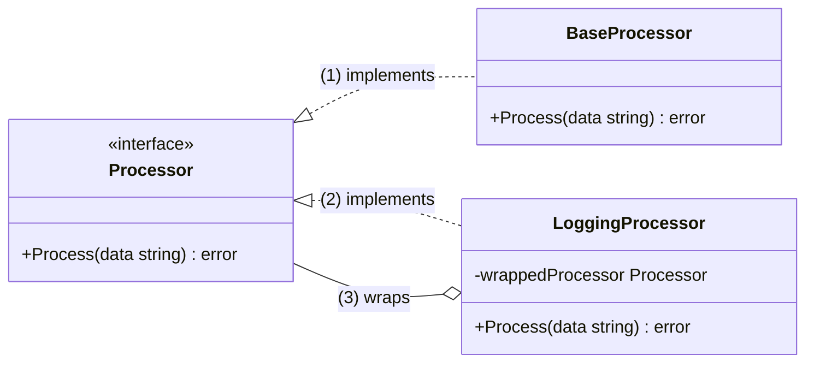

既存のコードを改変せずに新しい機能やロジックを追加することは、ソフトウェア開発において非常に重要なテクニックです。これは「オープン/クローズドの原則」という設計原則に基づいています。つまり、「ソフトウェアのエンティティは、拡張に対しては開いており、修正に対しては閉じているべきである」という考え方です。

Go言語では、この原則を実現するためにいくつかの強力なアプローチがあります。ここでは特に代表的で実践的な2つの方法を、具体的なコード例と共に解説します。

---

### アプローチ1：構造体の埋め込み (Embedding)

既存の構造体を新しい構造体に「埋め込む」ことで、既存の機能（メソッドやフィールド）を継承したかのように利用しつつ、新しい機能を追加する最もGoらしいシンプルな方法です。

#### 状況設定

`Notifier` という、メッセージを通知する既存の構造体があるとします。このコードは変更できません。

Go

```
// 既存のコード (変更不可)
package existing

import "fmt"

type Notifier struct {
	Endpoint string
}

func (n *Notifier) Send(message string) {
	fmt.Printf("Sending '%s' to %s\n", message, n.Endpoint)
}
```

#### 新機能の追加

この `Notifier` に、通知を送る前にログを出力する機能を追加したいとします。

#### 実装コード

`existing.Notifier` を埋め込んだ新しい構造体 `LoggingNotifier` を作成します。

Go

```
package main

import (
	"fmt"
	"log"
	"time"
	
	// "your_project/existing" は実際のプロジェクトパスに置き換えてください
	"your_project/existing" 
)

// Notifierを埋め込んだ新しい構造体
type LoggingNotifier struct {
	existing.Notifier // 既存のNotifierを埋め込む
}

// 新しい機能を持つコンストラクタ
func NewLoggingNotifier(endpoint string) *LoggingNotifier {
	return &LoggingNotifier{
		Notifier: existing.Notifier{Endpoint: endpoint},
	}
}

// 既存のSendメソッドをオーバーライド(のような振る舞い)
// 実際にはLoggingNotifier型の新しいメソッド
func (ln *LoggingNotifier) Send(message string) {
	// 新しいロジックを追加
	log.Printf("About to send a message at %s", time.Now().Format(time.RFC3339))
	
	// 埋め込んだNotifierのメソッドを呼び出す
	ln.Notifier.Send(message)
}


func main() {
	// 既存のNotifierの利用方法
	fmt.Println("--- Using Existing Notifier ---")
	notifier := &existing.Notifier{Endpoint: "api.example.com"}
	notifier.Send("Hello, World!")

	fmt.Println("\n--- Using Enhanced LoggingNotifier ---")
	// 機能拡張したLoggingNotifierを利用
	loggingNotifier := NewLoggingNotifier("api.example.com")
	loggingNotifier.Send("Hello with Logging!")
}
```

#### 実行結果

```
--- Using Existing Notifier ---
Sending 'Hello, World!' to api.example.com

--- Using Enhanced LoggingNotifier ---
2025/07/06 16:45:00 About to send a message at 2025-07-06T16:45:00+09:00
Sending 'Hello with Logging!' to api.example.com
```

この方法では、既存の `Notifier` のコードには一切触れずに、ログ出力という新しい責務を持つ `LoggingNotifier` を作成できました。

---

### アプローチ2：インターフェースとデコレータパターン

既存のコードが具体的な構造体ではなく**インターフェース**に依存して書かれている場合、**デコレータパターン**が非常に有効です。同じインターフェースを満たす「デコレータ」構造体で既存のオブジェクトをラップ（装飾）することで、振る舞いを追加していきます。

#### 状況設定

データ処理を行うための `Processor` というインターフェースと、その基本的な実装である `BaseProcessor` があるとします。

Go

```
// 既存のコード (変更不可)
package existing

import "fmt"

// Processorインターフェース
type Processor interface {
	Process(data string) error
}

// 既存の基本的な実装
type BaseProcessor struct{}

func (p *BaseProcessor) Process(data string) error {
	fmt.Printf("Processing data: %s\n", data)
	return nil
}
```

#### 新機能の追加

このデータ処理の前後に、処理時間の計測とロギング機能を追加したいと考えます。

#### 実装コード

`Processor` インターフェースを満たすデコレータ `LoggingProcessor` を作成します。この構造体は、ラップ対象となる別の `Processor` を内部に持ちます。

Go

```
package main

import (
	"fmt"
	"log"
	"time"

	// "your_project/existing" は実際のプロジェクトパスに置き換えてください
	"your_project/existing"
)

// ロギング機能を追加するデコレータ
type LoggingProcessor struct {
	// ラップする対象（同じインターフェース型）
	wrappedProcessor existing.Processor
}

// 新しいデコレータを作成するコンストラクタ
func NewLoggingProcessor(processor existing.Processor) *LoggingProcessor {
	return &LoggingProcessor{wrappedProcessor: processor}
}

// Processorインターフェースの要件を満たす
func (lp *LoggingProcessor) Process(data string) error {
	// (1) 前処理: 開始ログ
	log.Printf("Start processing data: %s", data)
	startTime := time.Now()

	// (2) 元の処理の呼び出し
	err := lp.wrappedProcessor.Process(data)
	if err != nil {
		log.Printf("Error during processing: %v", err)
	}

	// (3) 後処理: 終了ログと処理時間
	duration := time.Since(startTime)
	log.Printf("Finished processing. Duration: %s", duration)
	
	return err
}

func main() {
	// 基本的なプロセッサ
	baseProcessor := &existing.BaseProcessor{}

	// 基本的なプロセッサをロギングデコレータでラップする
	loggingProcessor := NewLoggingProcessor(baseProcessor)
	
	fmt.Println("--- Using Decorated Processor ---")
	// デコレータ経由でメソッドを呼び出す
	loggingProcessor.Process("important data")
}
```

#### 実行結果

```
--- Using Decorated Processor ---
2025/07/06 16:45:00 Start processing data: important data
Processing data: important data
2025/07/06 16:45:00 Finished processing. Duration: 0s
```

#### デコレータパターンの構造

このパターンの関係性を図で示すと以下のようになります。`LoggingProcessor` が `BaseProcessor` をラップし、両方とも同じ `Processor` インターフェースを実装している点がポイントです。

Code snippet



---

### まとめ

|アプローチ|長所|短所|適したケース|
|---|---|---|---|
|**構造体の埋め込み**|シンプルで直感的。コード量が少ない。|密結合になりやすい。埋め込んだ型のメソッドを個別にオーバーライドする必要がある。|既存の型に機能を追加し、新しい一つの型として扱いたい場合。|
|**インターフェースとデコレータ**|疎結合で柔軟性が高い。複数のデコレータを組み合わせ可能。|コード量が増え、構造が少し複雑になる。既存コードがインターフェースに依存している必要がある。|既存の処理の前後に横断的な関心事（ロギング、認証、キャッシュ等）を追加したい場合。|

どちらのアプローチを選択するかは、既存のコードの設計と、追加したい機能の性質によって決まります。柔軟で保守性の高いシステムを構築するために、これらのテクニックをぜひ活用してください。