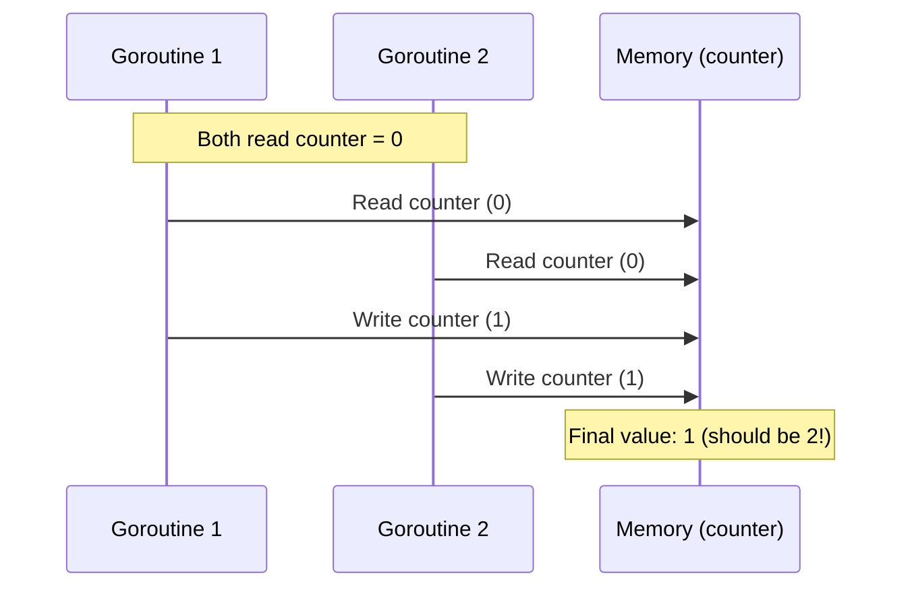
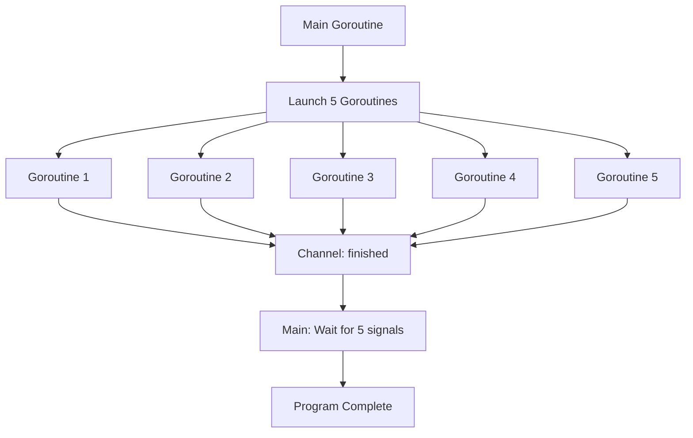
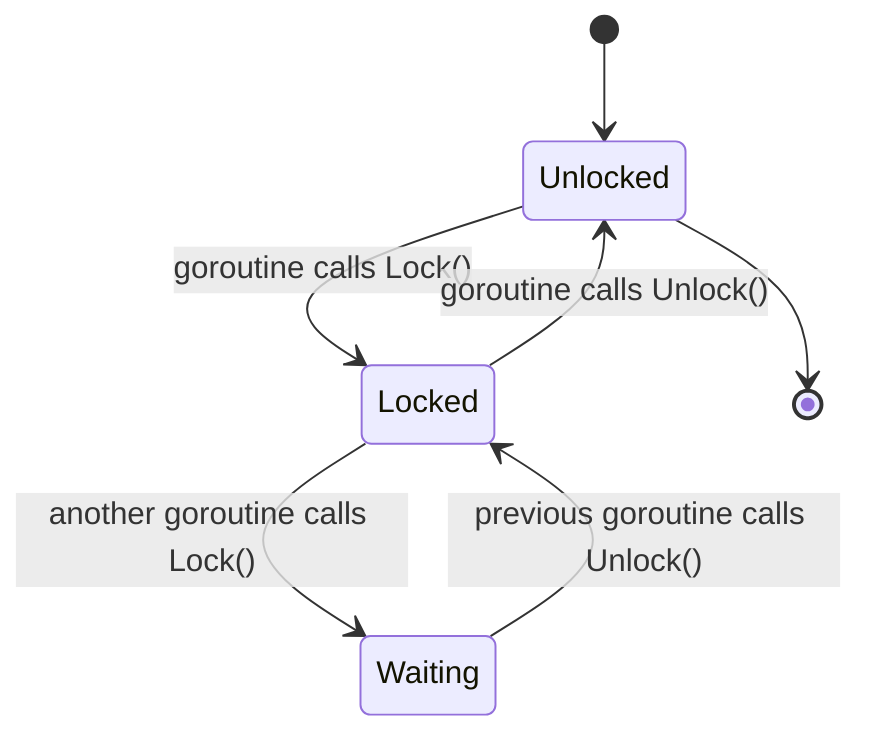

# Golang Concurrency: Channels and Mutex (Mutual Exclusion)

## Overview

This document provides a comprehensive reference for Go concurrency patterns, specifically focusing on goroutines, channels, and mutex (mutual exclusion) mechanisms. These concepts are fundamental for writing safe concurrent programs in Go, particularly important in DevOps and cloud engineering contexts where parallel processing and thread safety are critical.

## Table of Contents

1. [Goroutines and Anonymous Functions](#goroutines-and-anonymous-functions)
2. [Race Conditions and Data Safety](#race-conditions-and-data-safety)
3. [Pointer vs Value Semantics in Concurrent Context](#pointer-vs-value-semantics-in-concurrent-context)
4. [Channels for Synchronization](#channels-for-synchronization)
5. [Mutex: Mutual Exclusion](#mutex-mutual-exclusion)
6. [Best Practices and Design Principles](#best-practices-and-design-principles)
7. [Real-World Use Cases](#real-world-use-cases)
8. [Common Pitfalls and Solutions](#common-pitfalls-and-solutions)

## Goroutines and Anonymous Functions

### Concept

Goroutines are lightweight threads managed by the Go runtime. They enable concurrent execution of functions with minimal overhead compared to traditional OS threads.

### Code Example: Basic Goroutine with Anonymous Function

```go
package main

import (
    "fmt"
    "sync"
)

type MyType struct {
    counter int
    mu      sync.Mutex
}

func main() {
    mytypeInstance := MyType{}
    
    // Anonymous goroutine - executes immediately
    go func(instance *MyType) {
        instance.counter++
        fmt.Printf("Counter: %d\n", instance.counter)
    }(&mytypeInstance)
    
    // Wait to ensure goroutine completes
    time.Sleep(time.Second)
}
```

### Why Anonymous Functions?

The instructor demonstrates anonymous functions (`go func() { ... }()`) for several reasons:

1. **Inline Definition**: No need to define separate functions for simple concurrent tasks
2. **Closure Access**: Can capture variables from the surrounding scope
3. **Immediate Execution**: The `()` at the end executes the function immediately as a goroutine

## Race Conditions and Data Safety

### The Problem: Concurrent Access Without Protection

```go
// UNSAFE: Race condition example
type MyType struct {
    counter int
}

func main() {
    mytypeInstance := MyType{}
    finished := make(chan bool)
    
    // Launch 10 concurrent goroutines
    for i := 0; i < 10; i++ {
        go func(instance *MyType) {
            fmt.Printf("input counter: %d\n", instance.counter)
            instance.counter++  // RACE CONDITION!
            fmt.Printf("output counter: %d\n", instance.counter)
            finished <- true
        }(&mytypeInstance)
    }
    
    // Wait for all goroutines
    for i := 0; i < 10; i++ {
        <-finished
    }
}
```

### Race Condition Visualization



### Why Race Conditions Occur

1. **Non-atomic Operations**: `counter++` is actually three operations:
   - Read current value
   - Increment value
   - Write back to memory

2. **Unpredictable Scheduling**: Go scheduler can interrupt goroutines at any point

3. **Shared Memory Access**: Multiple goroutines accessing the same memory location

## Pointer vs Value Semantics in Concurrent Context

### Value Semantics (Copy) - Safer but Limited

```go
func main() {
    mytypeInstance := MyType{counter: 0}
    
    for i := 0; i < 5; i++ {
        go func(instance MyType) { // Pass by value
            instance.counter++  // Only modifies local copy
            fmt.Printf("Counter: %d\n", instance.counter)
        }(mytypeInstance)
    }
}
```

**Result**: Each goroutine gets its own copy, no race condition but changes don't persist.

### Pointer Semantics (Reference) - Powerful but Requires Protection

```go
func main() {
    mytypeInstance := MyType{counter: 0}
    
    for i := 0; i < 5; i++ {
        go func(instance *MyType) { // Pass by pointer
            instance.counter++  // Modifies shared state - RACE CONDITION!
            fmt.Printf("Counter: %d\n", instance.counter)
        }(&mytypeInstance)
    }
}
```

**Result**: All goroutines share the same memory, enabling state changes but creating race conditions.

## Channels for Synchronization

### Channel Fundamentals

Channels are Go's way of implementing the CSP (Communicating Sequential Processes) model. They allow goroutines to communicate and synchronize.

```go
// Channel creation and usage
finished := make(chan bool)

// Send to channel (blocks until received)
finished <- true

// Receive from channel (blocks until sent)
<-finished
```

### Synchronization Pattern

```go
func main() {
    finished := make(chan bool)
    
    // Launch goroutines
    for i := 0; i < 5; i++ {
        go func(id int) {
            fmt.Printf("Goroutine %d working...\n", id)
            time.Sleep(time.Second)
            finished <- true  // Signal completion
        }(i)
    }
    
    // Wait for all to complete
    for i := 0; i < 5; i++ {
        <-finished  // Block until signal received
    }
    
    fmt.Println("All goroutines completed")
}
```

### Channel Communication Diagram



## Mutex: Mutual Exclusion

### The Solution: sync.Mutex

```go
type MyType struct {
    counter int
    mu      sync.Mutex  // Mutual exclusion lock
}

func main() {
    mytypeInstance := MyType{}
    finished := make(chan bool)
    
    for i := 0; i < 10; i++ {
        go func(instance *MyType) {
            instance.mu.Lock()   // Acquire lock
            defer instance.mu.Unlock()  // Release lock when function exits
            
            fmt.Printf("input counter: %d\n", instance.counter)
            instance.counter++
            
            // Simulate work with random delay
            time.Sleep(time.Duration(rand.Intn(5)) * time.Second)
            
            if instance.counter == 5 {
                fmt.Printf("Found counter == 5\n")
            }
            fmt.Printf("output counter: %d\n", instance.counter)
            finished <- true
        }(&mytypeInstance)
    }
    
    for i := 0; i < 10; i++ {
        <-finished
    }
    fmt.Printf("Final Counter: %d\n", mytypeInstance.counter)
}
```

### Mutex State Diagram



### Alternative: Method-Based Locking

```go
type MyType struct {
    counter int
    mu      sync.Mutex
}

func (m *MyType) IncreaseCounter() {
    m.mu.Lock()
    defer m.mu.Unlock()
    m.counter++
}

func main() {
    mytypeInstance := MyType{}
    finished := make(chan bool)
    
    for i := 0; i < 10; i++ {
        go func(instance *MyType) {
            instance.IncreaseCounter()  // Thread-safe method
            finished <- true
        }(&mytypeInstance)
    }
    
    for i := 0; i < 10; i++ {
        <-finished
    }
}
```

## Best Practices and Design Principles

### 1. **Defer Unlock Pattern**

Always use `defer` to ensure mutex is unlocked:

```go
func (m *MyType) SafeOperation() {
    m.mu.Lock()
    defer m.mu.Unlock()  // Ensures unlock even if panic occurs
    
    // Critical section
    m.counter++
}
```

### 2. **Minimize Critical Sections**

Keep the locked section as small as possible:

```go
// GOOD: Minimal critical section
func (m *MyType) ProcessData(data []int) {
    result := expensiveCalculation(data)  // Outside critical section
    
    m.mu.Lock()
    m.counter += result  // Only the shared state modification is locked
    m.mu.Unlock()
}

// BAD: Unnecessarily large critical section
func (m *MyType) ProcessDataBad(data []int) {
    m.mu.Lock()
    result := expensiveCalculation(data)  // Expensive operation in critical section
    m.counter += result
    m.mu.Unlock()
}
```

### 3. **Prefer Channels Over Shared Memory**

**Go Philosophy**: "Don't communicate by sharing memory; share memory by communicating."

```go
// Channel-based approach (preferred)
func worker(input <-chan int, output chan<- int) {
    for data := range input {
        result := process(data)
        output <- result
    }
}

// vs Mutex-based approach (when necessary)
type Counter struct {
    value int
    mu    sync.Mutex
}

func (c *Counter) Increment() {
    c.mu.Lock()
    defer c.mu.Unlock()
    c.value++
}
```

### 4. **Random Delays for Testing**

The instructor uses `time.Sleep(time.Duration(rand.Intn(5)) * time.Second)` to:

- **Simulate Real-World Conditions**: Network calls, disk I/O, etc.
- **Expose Race Conditions**: Random timing makes concurrency bugs more visible
- **Test Synchronization**: Ensures locks work under various timing scenarios

```go
// Never use math/rand for cryptographic purposes!
import "math/rand"  // For testing/simulation only

// For cryptographic randomness:
import "crypto/rand"
```

## Real-World Use Cases

### 1. **Web Server Request Counters**

```go
type ServerStats struct {
    requestCount int64
    mu           sync.RWMutex  // Read-Write mutex for better performance
}

func (s *ServerStats) IncrementRequests() {
    s.mu.Lock()
    defer s.mu.Unlock()
    s.requestCount++
}

func (s *ServerStats) GetRequestCount() int64 {
    s.mu.RLock()  // Read lock allows multiple concurrent readers
    defer s.mu.RUnlock()
    return s.requestCount
}
```

### 2. **Database Connection Pool**

```go
type ConnectionPool struct {
    connections []Connection
    mu          sync.Mutex
}

func (p *ConnectionPool) GetConnection() Connection {
    p.mu.Lock()
    defer p.mu.Unlock()
    
    if len(p.connections) == 0 {
        return nil  // Pool exhausted
    }
    
    conn := p.connections[0]
    p.connections = p.connections[1:]
    return conn
}

func (p *ConnectionPool) ReturnConnection(conn Connection) {
    p.mu.Lock()
    defer p.mu.Unlock()
    p.connections = append(p.connections, conn)
}
```

### 3. **Cache with Expiration**

```go
type Cache struct {
    data map[string]CacheItem
    mu   sync.RWMutex
}

type CacheItem struct {
    value   interface{}
    expiry  time.Time
}

func (c *Cache) Set(key string, value interface{}, ttl time.Duration) {
    c.mu.Lock()
    defer c.mu.Unlock()
    
    c.data[key] = CacheItem{
        value:  value,
        expiry: time.Now().Add(ttl),
    }
}

func (c *Cache) Get(key string) (interface{}, bool) {
    c.mu.RLock()
    defer c.mu.RUnlock()
    
    item, exists := c.data[key]
    if !exists || time.Now().After(item.expiry) {
        return nil, false
    }
    
    return item.value, true
}
```

## Common Pitfalls and Solutions

### 1. **Deadlock Prevention**

```go
// BAD: Potential deadlock
type BankAccount struct {
    balance int
    mu      sync.Mutex
}

func Transfer(from, to *BankAccount, amount int) {
    from.mu.Lock()
    to.mu.Lock()    // Potential deadlock if another goroutine locks in reverse order
    
    from.balance -= amount
    to.balance += amount
    
    to.mu.Unlock()
    from.mu.Unlock()
}

// GOOD: Consistent locking order
func TransferSafe(from, to *BankAccount, amount int) {
    // Always lock in consistent order (e.g., by memory address)
    if uintptr(unsafe.Pointer(from)) < uintptr(unsafe.Pointer(to)) {
        from.mu.Lock()
        to.mu.Lock()
    } else {
        to.mu.Lock()
        from.mu.Lock()
    }
    defer from.mu.Unlock()
    defer to.mu.Unlock()
    
    from.balance -= amount
    to.balance += amount
}
```

### 2. **Goroutine Leaks**

```go
// BAD: Goroutine leak
func leakyFunction() {
    ch := make(chan int)
    
    go func() {
        ch <- 42  // This goroutine will block forever if no one reads
    }()
    
    // Function returns without reading from channel
    // Goroutine remains blocked forever
}

// GOOD: Proper cleanup
func cleanFunction() {
    ch := make(chan int, 1)  // Buffered channel prevents blocking
    
    go func() {
        ch <- 42
    }()
    
    select {
    case result := <-ch:
        fmt.Println("Received:", result)
    case <-time.After(time.Second):
        fmt.Println("Timeout")
    }
}
```

### 3. **Incorrect Channel Usage**

```go
// BAD: Sending on closed channel causes panic
func badChannelUsage() {
    ch := make(chan int)
    close(ch)
    ch <- 42  // Panic: send on closed channel
}

// GOOD: Check if channel is closed
func goodChannelUsage() {
    ch := make(chan int)
    
    // Use select with default to avoid blocking
    select {
    case ch <- 42:
        fmt.Println("Sent successfully")
    default:
        fmt.Println("Channel is full or closed")
    }
}
```

## Performance Considerations

### When to Use Mutex vs Channels

| Scenario | Use Mutex | Use Channels |
|----------|-----------|--------------|
| Protecting shared state | ✅ | ❌ |
| Simple counter/statistics | ✅ | ❌ |
| Complex state transitions | ✅ | ❌ |
| Communication between goroutines | ❌ | ✅ |
| Fan-out/Fan-in patterns | ❌ | ✅ |
| Pipeline processing | ❌ | ✅ |
| Signaling completion | ❌ | ✅ |

### Mutex Types Comparison

```go
// sync.Mutex - Basic mutual exclusion
type BasicCounter struct {
    count int
    mu    sync.Mutex
}

// sync.RWMutex - Read-Write mutex (better for read-heavy workloads)
type ReadWriteCounter struct {
    count int
    mu    sync.RWMutex
}

func (c *ReadWriteCounter) Read() int {
    c.mu.RLock()    // Multiple readers allowed
    defer c.mu.RUnlock()
    return c.count
}

func (c *ReadWriteCounter) Write(value int) {
    c.mu.Lock()     // Exclusive write access
    defer c.mu.Unlock()
    c.count = value
}
```

## Conclusion

The instructor's mutex demo effectively demonstrates the evolution from unsafe concurrent code to safe, well-structured concurrent programs. The key principles are:

1. **Start Simple**: Begin with basic goroutines and channels
2. **Identify Race Conditions**: Use tools and techniques to expose concurrency bugs
3. **Apply Appropriate Synchronization**: Choose between mutex and channels based on the use case
4. **Follow Go Idioms**: "Don't communicate by sharing memory; share memory by communicating"
5. **Test Thoroughly**: Use random delays and stress testing to expose concurrency issues

Understanding these concepts is crucial for DevOps and cloud engineering, where concurrent processing, data integrity, and system reliability are paramount. The mutex pattern is particularly important when building robust services that handle multiple simultaneous requests while maintaining data consistency.
