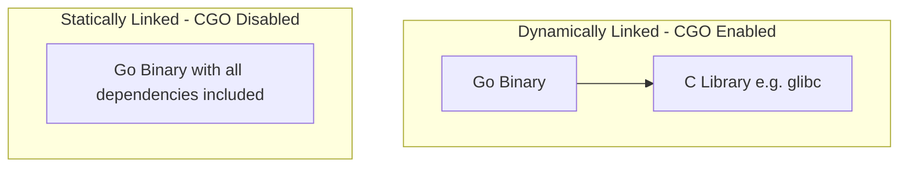
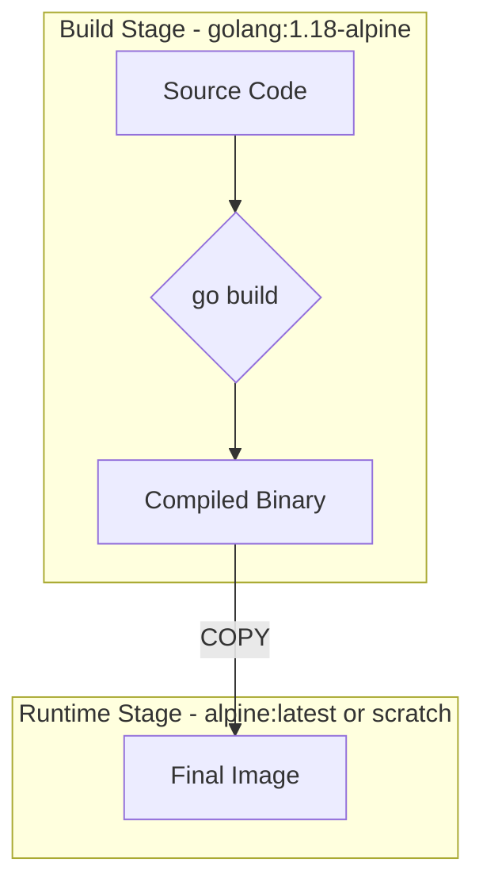

# Raymond's Notes: Building and Packaging Go Applications

This document provides a comprehensive reference on building and packaging Go applications, focusing on cross-compilation, CGO, and containerization with Docker. These notes are based on the course materials from lectures 32 and 33.

## 1. Cross-Compiling Go Code

Go has built-in support for cross-compilation, which allows you to build executables for different operating systems and architectures from a single development machine. This is a powerful feature for DevOps engineers who need to deploy applications across various environments.

To cross-compile, you need to set the `GOOS` (target operating system) and `GOARCH` (target architecture) environment variables before running `go build`.

You can list all supported combinations of `GOOS` and `GOARCH` with the following command:

```bash
go tool dist list
```

For example, to compile an application for a 64-bit Windows system from a Linux machine, you would use:

```bash
GOOS=windows GOARCH=amd64 go build -o myapp.exe .
```

## 2. Understanding CGO

CGO allows Go programs to call C code. While you may not write C code yourself, some of Go's standard libraries, like the `net` package, use CGO for functionalities such as DNS resolution.

### Dynamically vs. Statically Linked Binaries

When CGO is enabled (which it is by default when not cross-compiling), the resulting Go binary is **dynamically linked**. This means it depends on external C libraries (like `glibc` on Ubuntu or `musl` on Alpine Linux) that are expected to be present on the target system.

When CGO is disabled, the Go compiler creates a **statically linked** binary. This includes all necessary libraries directly within the executable, making it self-contained and portable across different systems of the same OS and architecture, even if they have different C library versions.

Here's a diagram illustrating the difference:



### Enabling and Disabling CGO

-   **Enabled by default**: `cgo enabled=1 go build` (or just `go build`). This results in a smaller binary and faster build times if the required C libraries are on the system.
-   **Disable CGO**: `CGO_ENABLED=0 go build`. This is necessary when:
    -   Cross-compiling.
    -   Deploying to a system with a different C library than the build system (e.g., building on Ubuntu and deploying on Alpine).

The instructor demonstrated creating a static binary with the following command:

```bash
CGO_ENABLED=0 go build -o main-nocgo main.go
```

Using `ldd` on the resulting binaries shows the difference: the dynamically linked one has dependencies, while the static one does not.

## 3. Packaging Go Applications with Docker

Docker is the standard way to package and distribute applications. For Go, multi-stage Docker builds are a best practice to create small, efficient, and secure container images.

### Multi-Stage Docker Builds

A multi-stage build uses multiple `FROM` instructions in a single `Dockerfile`. Each `FROM` instruction can use a different base image and begins a new stage of the build. You can selectively copy artifacts from one stage to another, leaving behind everything you don't want in the final image.

This is ideal for Go: you can use a larger "builder" image with the full Go toolchain and then copy only the compiled binary to a smaller "runtime" image.

Here's a visualization of the process:



### Approach 1: Using an Alpine-based Runtime Image

This approach uses a minimal Linux distribution like Alpine as the base for the runtime image.

**`Dockerfile`:**
```dockerfile
# Build stage
FROM golang:1.18-alpine as go-builder
WORKDIR /app
COPY . .
RUN apk add --no-cache build-base git && \
    go build -o server *.go

# Runtime stage
FROM alpine:latest
WORKDIR /app
COPY --from=go-builder /app/server /app/server
EXPOSE 8080
ENTRYPOINT ["/app/server"]
```

**Why this approach?**
-   **Small Image Size**: Alpine is much smaller than other distributions like Ubuntu.
-   **Security**: Fewer packages mean a smaller attack surface.
-   **Debugging**: You still have a shell (`/bin/sh`) and a package manager (`apk`), which can be useful for debugging running containers.

### Approach 2: Using a Scratch-based Runtime Image

For the absolute smallest image size, you can use the `scratch` base image, which is empty.

**`Dockerfile.scratch`:**
```dockerfile
# Build stage (same as before, but with CGO disabled)
FROM golang:1.18-alpine as go-builder
WORKDIR /app
COPY . .
RUN CGO_ENABLED=0 go build -o server *.go

# Runtime stage
FROM scratch
COPY --from=go-builder /app/server /server
EXPOSE 8080
ENTRYPOINT ["/server"]
```

**Why this approach?**
-   **Minimalism**: The final image contains only your binary and nothing else.
-   **Security**: The ultimate minimal attack surface.

**Important Consideration**: When using `scratch`, the binary *must* be statically linked, which is why `CGO_ENABLED=0` is added to the build command. Also, because there are no `ca-certificates` in a scratch image, making outbound HTTPS calls from the application will fail unless you manually copy them into the image.

### Comparison

| Feature | Alpine Image | Scratch Image |
| :--- | :--- | :--- |
| **Size** | ~12.8 MB | ~6.7 MB |
| **Security** | Very Good | Excellent |
| **Debugging** | Possible (has a shell) | Difficult (no shell or tools) |
| **Dependencies**| Includes `musl` libc | None (requires static binary) |

## 4. Conclusion

-   **Cross-compiling** is a key Go feature for multi-platform deployments.
-   Understanding **CGO** and its impact on binary linking is crucial for creating portable applications.
-   **Multi-stage Docker builds** are the best practice for creating optimized Go container images.
-   Choose between **Alpine** and **scratch** for your runtime image based on your trade-offs between image size, security, and ease of debugging.
