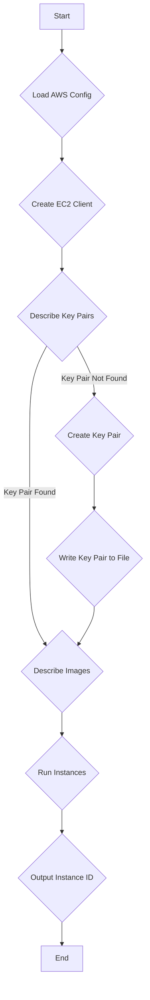

# Interacting with AWS EC2 using the Go SDK

This document provides a comprehensive guide to using the AWS SDK for Go to programmatically manage Amazon EC2 instances. We will explore the concepts, workflow, and best practices for developing a Go application that can launch EC2 instances. We will also discuss the developer's mindset when working with a new SDK and provide an equivalent implementation in Python.

## 1. Introduction

Amazon Web Services (AWS) is a popular cloud platform that offers a wide range of services, including Amazon Elastic Compute Cloud (EC2) for scalable virtual servers. While you can interact with AWS services through the web console or the command-line interface (CLI), the AWS SDK for Go provides a powerful way to automate and integrate AWS services into your Go applications.

This document will walk you through the process of creating a Go application that can launch an EC2 instance. We will analyze the provided source code, explain the logic behind it, and discuss the typical workflow for developing such an application.

## 2. Prerequisites

Before you can start using the AWS SDK for Go, you need to have the following:

*   **An AWS Account:** If you don't have one, you can create one on the [AWS website](https://aws.amazon.com/).
*   **An IAM User with Programmatic Access:** For security reasons, it's a best practice to create an IAM (Identity and Access Management) user with the necessary permissions to interact with AWS services. When creating the user, make sure to enable "programmatic access," which will provide you with an **Access Key ID** and a **Secret Access Key**.
*   **Configured AWS Credentials:** The AWS SDK for Go needs to be able to find your credentials to make authenticated API calls. You can configure them in several ways:
    *   **Using the AWS CLI:** This is the recommended approach. You can install the AWS CLI and then run `aws configure` to set up your credentials.
    *   **Environment Variables:** You can set the `AWS_ACCESS_KEY_ID`, `AWS_SECRET_ACCESS_KEY`, and `AWS_REGION` environment variables.
    *   **IAM Roles for EC2 (if running on an EC2 instance):** If your Go application is running on an EC2 instance, you can assign an IAM role to the instance, and the SDK will automatically use the credentials associated with that role.

## 3. Core Concepts

### 3.1. The AWS SDK for Go

The AWS SDK for Go is a library that simplifies interaction with AWS services. Instead of making raw HTTP requests to the AWS API endpoints and handling the complexities of authentication and response parsing yourself, the SDK provides a set of Go functions and types that abstract away these details.

For example, to launch an EC2 instance, you would need to make a carefully crafted HTTPS request with the correct authentication headers and then parse the JSON response. The SDK handles all of this for you, allowing you to simply call a function like `ec2.RunInstances`.

### 3.2. Key Packages

The following are the key packages from the AWS SDK for Go that we will be using:

*   `github.com/aws/aws-sdk-go-v2/config`: This package is used to load the default AWS configuration, including credentials and the region, from your environment.
*   `github.com/aws/aws-sdk-go-v2/service/ec2`: This package contains the client and the API operations for interacting with the Amazon EC2 service.
*   `github.com/aws/aws-sdk-go-v2/service/ec2/types`: This package provides the data types (structs and enums) used by the EC2 service, such as `types.InstanceType` and `types.Filter`.
*   `github.com/aws/aws-sdk-go-v2/aws`: This package provides helper functions, such as `aws.String` to convert a Go string to a pointer to a string, which is often required by the SDK's API calls.

### 3.3. The Importance of `context.Context`

The `context` package in Go is used to carry deadlines, cancellation signals, and other request-scoped values across API boundaries and between processes. The AWS SDK for Go uses `context.Context` in its API calls. This allows you to, for example, set a timeout for an API call or cancel it if it's taking too long. In our example, we will use `context.Background()`, which is a non-nil, empty context that is never canceled and has no values.

## 4. Workflow for Launching an EC2 Instance

The process of launching an EC2 instance with the Go SDK involves a series of steps. The following diagram illustrates the workflow:



Now, let's break down each step and examine the corresponding Go code.

### 4.1. The `main` Function

The `main` function is the entry point of our application. It initializes a `context.Context`, calls the `createEC2` function, and then prints the returned instance ID or an error.

```go
package main

import (
	"context"
	"fmt"
	"os"
	"strings"

	"github.com/aws/aws-sdk-go-v2/aws"
	"github.com/aws/aws-sdk-go-v2/config"
	"github.com/aws/aws-sdk-go-v2/service/ec2"
	"github.com/aws/aws-sdk-go-v2/service/ec2/types"
)

func main() {
	var (
		instanceId string
		err        error
	)
	if instanceId, err = createEC2(context.Background(), "us-east-1"); err != nil {
		fmt.Printf("Error: %s", err)
		os.Exit(1)
	}

	fmt.Printf("instance id: %s\n", instanceId)
}
```

### 4.2. The `createEC2` Function

This is the core function of our application. It encapsulates the logic for creating an EC2 instance.

#### 4.2.1. Loading the AWS Configuration

The first step is to load the AWS configuration. The `config.LoadDefaultConfig` function will look for credentials and the region in the standard locations (environment variables, AWS config file, etc.).

```go
func createEC2(ctx context.Context, region string) (string, error) {
	cfg, err := config.LoadDefaultConfig(ctx, config.WithRegion(region))
	if err != nil {
		return "", fmt.Errorf("LoadDefaultConfig error: %s", err)
	}
```

#### 4.2.2. Creating the EC2 Client

Once we have the configuration, we can create an EC2 client. This client is what we will use to make API calls to the EC2 service.

```go
	ec2Client := ec2.NewFromConfig(cfg)
```

#### 4.2.3. Managing the SSH Key Pair

To be able to connect to our EC2 instance, we need an SSH key pair. The following code first checks if a key pair with the name "go-aws-ec2" already exists. If it doesn't, it creates a new one and saves the private key to a file named `go-aws-ec2.pem`.

```go
	existingKeyPairs, err := ec2Client.DescribeKeyPairs(ctx, &ec2.DescribeKeyPairsInput{
		KeyNames: []string{"go-aws-ec2"},
	})
	if err != nil && !strings.Contains(err.Error(), "InvalidKeyPair.NotFound") {
		return "", fmt.Errorf("DescribeKeyPairs error: %s", err)
	}

	if existingKeyPairs == nil || len(existingKeyPairs.KeyPairs) == 0 {
		keyPair, err := ec2Client.CreateKeyPair(ctx, &ec2.CreateKeyPairInput{
			KeyName: aws.String("go-aws-ec2"),
		})
		if err != nil {
			return "", fmt.Errorf("CreateKeyPair error: %s", err)
		}

		err = os.WriteFile("go-aws-ec2.pem", []byte(*keyPair.KeyMaterial), 0600)
		if err != nil {
			return "", fmt.Errorf("WriteFile (keypair) error: %s", err)
		}
	}
```

**Explanation:**

*   **`DescribeKeyPairs`:** This function is used to check for the existence of a key pair.
*   **Error Handling:** The code specifically checks for the "InvalidKeyPair.NotFound" error. If this error occurs, it means the key pair doesn't exist, which is not a fatal error in this case. We only return an error if a different error occurs.
*   **`CreateKeyPair`:** If the key pair doesn't exist, this function is called to create a new one.
*   **`aws.String("go-aws-ec2")`:** Many of the input fields in the AWS SDK for Go expect pointers to values, not the values themselves. The `aws.String` helper function is used to convert a string to a pointer to a string.
*   **`os.WriteFile`:** This function is used to save the private key to a file. The `0600` file permission ensures that only the owner of the file can read and write to it, which is a security best practice for private keys.

#### 4.2.4. Finding the Ubuntu AMI

An Amazon Machine Image (AMI) is a pre-configured template for your instances. The following code searches for the latest Ubuntu 20.04 LTS AMI.

```go
	describeImages, err := ec2Client.DescribeImages(ctx, &ec2.DescribeImagesInput{
		Filters: []types.Filter{
			{
				Name:   aws.String("name"),
				Values: []string{"ubuntu/images/hvm-ssd/ubuntu-focal-20.04-amd64-server-*"},
			},
			{
				Name:   aws.String("virtualization-type"),
				Values: []string{"hvm"},
			},
		},
		Owners: []string{"099720109477"}, // Canonical's owner ID
	})
	if err != nil {
		return "", fmt.Errorf("DescribeImages error: %s", err)
	}
	if len(describeImages.Images) == 0 {
		return "", fmt.Errorf("describeImages has empty length (%d)", len(describeImages.Images))
	}
```

**Explanation:**

*   **`DescribeImages`:** This function is used to find AMIs that match the specified criteria.
*   **Filters:** We use filters to narrow down the search results. In this case, we are filtering by the AMI name and the virtualization type.
*   **Owners:** We specify the owner of the AMI to ensure we are using an official Ubuntu image. The owner ID `099720109477` belongs to Canonical, the company behind Ubuntu.

#### 4.2.5. Launching the EC2 Instance

Finally, we can launch the EC2 instance using the `RunInstances` function.

```go
	runInstance, err := ec2Client.RunInstances(ctx, &ec2.RunInstancesInput{
		ImageId:      describeImages.Images[0].ImageId,
		InstanceType: types.InstanceTypeT3Micro,
		KeyName:      aws.String("go-aws-ec2"),
		MinCount:     aws.Int32(1),
		MaxCount:     aws.Int32(1),
	})
	if err != nil {
		return "", fmt.Errorf("RunInstance error: %s", err)
	}

	if len(runInstance.Instances) == 0 {
		return "", fmt.Errorf("RunInstance has empty length (%d)", len(runInstance.Instances))
	}

	return *runInstance.Instances[0].InstanceId, nil
}
```

**Explanation:**

*   **`RunInstances`:** This is the function that actually launches the EC2 instance.
*   **`ImageId`:** We use the ID of the AMI we found in the previous step.
*   **`InstanceType`:** We specify the instance type, in this case, `t3.micro`, which is eligible for the AWS Free Tier.
*   **`KeyName`:** We specify the name of the key pair we created earlier.
*   **`MinCount` and `MaxCount`:** These parameters specify the minimum and maximum number of instances to launch.
*   **`aws.Int32(1)`:** Similar to `aws.String`, this helper function converts an integer to a pointer to an `int32`.
*   **Return Value:** The `RunInstances` function returns a `RunInstancesOutput` struct, which contains information about the launched instances, including the instance ID.

## 5. The Developer's Mindset: Sequential Thinking in SDK Development

When you are working with a new SDK, especially one as extensive as the AWS SDK, it's a process of exploration. You don't need to know everything upfront. The instructor in the course likely followed a typical sequential thinking process, which can be summarized as follows:

1.  **Start with the Goal:** The goal is to launch an EC2 instance.
2.  **Consult the Documentation:** The first step is to look at the AWS SDK for Go documentation to find the relevant function for launching an instance. This leads to the `RunInstances` function.
3.  **Examine the `RunInstances` Input:** By looking at the `RunInstancesInput` struct, you can see what parameters are required. You'll notice that you need an `ImageId`, an `InstanceType`, and a `KeyName`.
4.  **How to Get the `ImageId`?** This leads to the next question: how do I get an AMI ID? A search in the documentation will reveal the `DescribeImages` function.
5.  **How to Use `DescribeImages`?** Examining the `DescribeImagesInput` struct shows that you can use filters to find the desired AMI. You might need to do some research on the AWS website or use the AWS CLI to figure out the correct filter values.
6.  **How to Get the `KeyName`?** You need a key pair to be able to SSH into the instance. This leads to the `CreateKeyPair` and `DescribeKeyPairs` functions. You'll want to check if a key pair already exists before creating a new one to avoid errors on subsequent runs.
7.  **Putting It All Together:** Once you have figured out how to get all the necessary inputs for the `RunInstances` function, you can put all the pieces together in a logical sequence, as we have seen in the `createEC2` function.
8.  **Error Handling:** As you write the code, you need to think about potential errors and how to handle them. For example, what happens if the key pair already exists? What if no AMIs are found?

This iterative process of exploring the documentation, understanding the required inputs and outputs of functions, and handling potential errors is a fundamental part of developing applications with any SDK.

## 6. Python Implementation

Now, let's look at how we could implement the same functionality in Python using the `boto3` library, which is the AWS SDK for Python.

### 6.1. Project Structure

A typical Python project structure for this application would look like this:

```
aws-ec2-python/
├── venv/
├── src/
│   ├── __init__.py
│   └── main.py
├── requirements.txt
└── .gitignore
```

*   `venv/`: The Python virtual environment.
*   `src/main.py`: The main Python script.
*   `requirements.txt`: A file listing the project's dependencies (in this case, `boto3`).
*   `.gitignore`: A file to specify which files and directories to ignore in Git.

### 6.2. Key Code File Contents

Here is the content of `src/main.py`:

```python
import boto3
import os
from botocore.exceptions import ClientError

def create_ec2(region):
    """
    Launches an EC2 instance in the specified region.
    """
    try:
        ec2_client = boto3.client('ec2', region_name=region)

        # Check if the key pair exists
        try:
            ec2_client.describe_key_pairs(KeyNames=['go-aws-ec2'])
        except ClientError as e:
            if e.response['Error']['Code'] == 'InvalidKeyPair.NotFound':
                # Create the key pair
                key_pair = ec2_client.create_key_pair(KeyName='go-aws-ec2')
                # Save the private key
                with open('go-aws-ec2.pem', 'w') as f:
                    os.chmod('go-aws-ec2.pem', 0o600)
                    f.write(key_pair['KeyMaterial'])
            else:
                raise

        # Find the latest Ubuntu AMI
        response = ec2_client.describe_images(
            Filters=[
                {
                    'Name': 'name',
                    'Values': ['ubuntu/images/hvm-ssd/ubuntu-focal-20.04-amd64-server-*']
                },
                {
                    'Name': 'virtualization-type',
                    'Values': ['hvm']
                }
            ],
            Owners=['099720109477']
        )
        image_id = response['Images'][0]['ImageId']

        # Launch the EC2 instance
        instance = ec2_client.run_instances(
            ImageId=image_id,
            InstanceType='t3.micro',
            KeyName='go-aws-ec2',
            MinCount=1,
            MaxCount=1
        )

        return instance['Instances'][0]['InstanceId']

    except ClientError as e:
        return f"Error: {e}"

if __name__ == '__main__':
    instance_id = create_ec2('us-east-1')
    print(f"Instance ID: {instance_id}")

```

As you can see, the logic is very similar to the Go implementation. We use the `boto3` library to create an EC2 client, manage the key pair, find an AMI, and launch the instance.

## 7. Conclusion

In this document, we have explored how to use the AWS SDK for Go to launch an EC2 instance. We have seen how the SDK simplifies the process of interacting with AWS services and how to structure a Go application to perform this task. We have also discussed the typical thought process for developing with an SDK and provided an equivalent implementation in Python. By understanding these concepts and following the best practices outlined in this document, you can effectively use the AWS SDK for Go to automate and manage your AWS infrastructure.
