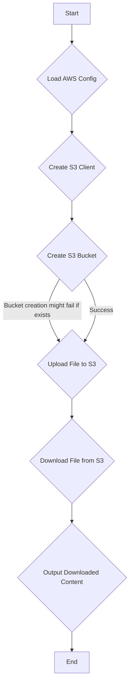

# Interacting with AWS S3 using the Go SDK

This document provides a comprehensive guide to using the AWS SDK for Go to programmatically manage Amazon S3 buckets and objects. We will explore the concepts, workflow, and best practices for developing a Go application that can create buckets, upload, and download files. We will also discuss the developer's mindset when working with a new SDK and provide an equivalent implementation in Python.

## 1. Introduction

Amazon Simple Storage Service (S3) is a scalable object storage service from AWS. It allows you to store and retrieve any amount of data from anywhere on the web. While the AWS Management Console and CLI are useful for manual operations, the AWS SDK for Go provides a powerful way to integrate S3 into your Go applications, enabling automation for tasks like backups, data processing pipelines, and content delivery.

This document will walk you through creating a Go application that interacts with S3 to create a bucket, upload a file to it, and then download the same file.

## 2. Prerequisites

Before you begin, ensure you have the following set up:

*   **An AWS Account:** If you don't have one, you can create one on the [AWS website](https://aws.amazon.com/).
*   **An IAM User with Programmatic Access:** For security, it's best to create an IAM user with the necessary permissions for S3 (`AmazonS3FullAccess` for this example, but scope down for production). When creating the user, enable "programmatic access" to get an **Access Key ID** and a **Secret Access Key**.
*   **Configured AWS Credentials:** The AWS SDK for Go needs your credentials to make authenticated API calls. You can configure them in several ways:
    *   **Using the AWS CLI (Recommended):** Install the AWS CLI and run `aws configure` to set up your credentials file (`~/.aws/credentials`).
    *   **Environment Variables:** Set the `AWS_ACCESS_KEY_ID`, `AWS_SECRET_ACCESS_KEY`, and `AWS_REGION` environment variables.
    *   **IAM Roles for EC2:** If your application runs on an EC2 instance, assign an IAM role to the instance, and the SDK will automatically use the associated credentials.

## 3. Core Concepts

### 3.1. The AWS SDK for Go V2

The AWS SDK for Go V2 provides Go packages and types to interact with the entire suite of AWS services. It simplifies development by handling complex tasks like request signing, response parsing, and error handling, allowing you to focus on the application logic.

### 3.2. Key Packages

The following are the key packages from the AWS SDK for Go that we will be using for S3 operations:

*   `github.com/aws/aws-sdk-go-v2/config`: This package is used to load the default AWS configuration, including credentials and the region, from your environment.
*   `github.com/aws/aws-sdk-go-v2/service/s3`: This package contains the client and the low-level API operations for interacting with the Amazon S3 service (e.g., `CreateBucket`).
*   `github.com/aws/aws-sdk-go-v2/feature/s3/manager`: This package provides higher-level, managed abstractions for S3 operations. It's highly recommended for file transfers as it automatically handles multipart uploads and downloads for large files, improving performance and reliability.
*   `github.com/aws/aws-sdk-go-v2/aws`: This package provides helper functions, such as `aws.String` to convert a Go string to a pointer to a string, which is a common requirement for the SDK's API call inputs.

### 3.3. The Importance of `context.Context`

The `context` package in Go is crucial for managing deadlines, cancellation signals, and other request-scoped values across API boundaries. The AWS SDK for Go V2 requires a `context.Context` for all API calls. This allows you to control the execution of an API call, for instance, by setting a timeout or canceling it if it's no longer needed. In our example, we will use `context.Background()`, which provides a non-nil, empty context that is never canceled and has no values or deadlines.

## 4. Workflow for S3 File Operations

The process of uploading and downloading a file to S3 with the Go SDK follows a clear sequence. The following diagram illustrates the workflow:



Now, let's break down each step and examine the corresponding Go code from the `aws-s3/main.go` example.

### 4.1. The `main` Function

The `main` function orchestrates the entire process. It initializes the S3 client and then calls functions to create the bucket, upload the file, and download it, printing the results to the console.

```go
package main

import (
	"context"
	"fmt"
	"os"
	"strings"

	"github.com/aws/aws-sdk-go-v2/aws"
	"github.com/aws/aws-sdk-go-v2/config"
	"github.com/aws/aws-sdk-go-v2/feature/s3/manager"
	"github.com/aws/aws-sdk-go-v2/service/s3"
)

const s3BucketName = "go-aws-test-xz9"

func main() {
	var (
		s3Client *s3.Client
		err      error
		out      []byte
	)
	if s3Client, err = initS3Client(context.Background(), "us-east-1"); err != nil {
		fmt.Printf("initConfig error: %s", err)
		os.Exit(1)
	}
	if err = createS3Bucket(context.Background(), s3Client); err != nil {
		// Note: This will error if the bucket already exists. 
		// A production app should handle this gracefully.
		fmt.Printf("createS3Bucket error: %s", err)
	}
	if err = uploadFileToS3(context.Background(), s3Client); err != nil {
		fmt.Printf("uploadFileToS3 error: %s", err)
		os.Exit(1)
	}
	fmt.Printf("Uploaded file.\n")
	if out, err = downloadFileFromS3(context.Background(), s3Client); err != nil {
		fmt.Printf("downloadFileFromS3 error: %s", err)
		os.Exit(1)
	}
	fmt.Printf("Downloaded file with contents: %s\n", out)
}
```

### 4.2. The `initS3Client` Function

This function loads the default AWS configuration and creates a new S3 client from it.

```go
func initS3Client(ctx context.Context, region string) (*s3.Client, error) {
	cfg, err := config.LoadDefaultConfig(ctx, config.WithRegion(region))
	if err != nil {
		return nil, fmt.Errorf("Config error: %s", err)
	}
	return s3.NewFromConfig(cfg), nil
}
```

### 4.3. The `createS3Bucket` Function

This function attempts to create a new S3 bucket. Note that S3 bucket names must be globally unique. If the bucket already exists (even in another account), this call will fail.

```go
func createS3Bucket(ctx context.Context, s3Client *s3.Client) error {
	_, err := s3Client.CreateBucket(ctx, &s3.CreateBucketInput{
		Bucket: aws.String(s3BucketName),
	})
	if err != nil {
		// In a real app, you should check for a `BucketAlreadyOwnedByYou` error
		// and treat it as a success.
		return fmt.Errorf("CreateBucket error: %s", err)
	}
	return nil
}
```

### 4.4. The `uploadFileToS3` Function

Here, we use the `s3/manager.NewUploader` to handle the file upload. This is the recommended way to upload files, as it abstracts away the complexities of multipart uploads for large files.

```go
func uploadFileToS3(ctx context.Context, s3Client *s3.Client) error {
	uploader := manager.NewUploader(s3Client)
	_, err := uploader.Upload(ctx, &s3.PutObjectInput{
		Bucket: aws.String(s3BucketName),
		Key:    aws.String("test.txt"),
		Body:   strings.NewReader("this is a test"),
	})
	if err != nil {
		return fmt.Errorf("Upload error: %s", err)
	}
	return nil
}
```
**Explanation:**
*   **`manager.NewUploader`**: Creates a new uploader instance.
*   **`uploader.Upload`**: Takes a `PutObjectInput` struct.
*   **`Bucket` and `Key`**: Specify the destination bucket and the name (key) of the object in S3.
*   **`Body`**: The content to be uploaded, provided as an `io.Reader`. Here we use `strings.NewReader` for a simple string, but it could be a file handle from `os.Open`.

### 4.5. The `downloadFileFromS3` Function

Similarly, we use `s3/manager.NewDownloader` for downloading. The downloader writes the object's contents into a buffer that implements the `io.WriterAt` interface.

```go
func downloadFileFromS3(ctx context.Context, s3Client *s3.Client) ([]byte, error) {
	buffer := manager.NewWriteAtBuffer([]byte{})

	downloader := manager.NewDownloader(s3Client)
	numBytes, err := downloader.Download(ctx, buffer, &s3.GetObjectInput{
		Bucket: aws.String(s3BucketName),
		Key:    aws.String("test.txt"),
	})
	if err != nil {
		return nil, fmt.Errorf("Download error: %s", err)
	}

	if bytesReceived := int64(len(buffer.Bytes())); numBytes != bytesReceived {
		return nil, fmt.Errorf("Incorrect number of bytes returned. Got %d, but expected %d", bytesReceived, numBytes)
	}
	return buffer.Bytes(), nil
}
```
**Explanation:**
*   **`manager.NewWriteAtBuffer`**: Creates an in-memory buffer that satisfies the `io.WriterAt` interface required by the downloader.
*   **`manager.NewDownloader`**: Creates a new downloader instance.
*   **`downloader.Download`**: Takes the buffer and a `GetObjectInput` struct to specify which object to download.
*   **Return Value**: The function returns the number of bytes downloaded. We compare this with the buffer's length to ensure the download was complete.

## 5. The Developer's Mindset: Sequential Thinking in SDK Development

When approaching a task with a new SDK, a developer typically follows a sequential, exploratory process. You don't need to know every detail upfront.

1.  **Define the Goal:** The primary goal is to upload and download a file from S3.
2.  **Consult the Documentation:** A search in the AWS SDK for Go documentation for "S3 upload file" would quickly lead to the `s3manager` package, highlighting it as the best practice for this task.
3.  **Examine the `Uploader`:** Looking at the `manager.Uploader`, you see it requires an `s3.Client` in its constructor (`NewUploader`).
4.  **How to Get an `s3.Client`?** The documentation shows that clients are created from a configuration, using `s3.NewFromConfig(cfg)`.
5.  **How to Get the `Config`?** This leads to the `config` package and the `config.LoadDefaultConfig` function, which conveniently loads settings from the environment.
6.  **What about the `Upload` Input?** The `uploader.Upload` method requires a `PutObjectInput` struct. Its definition reveals the necessary fields: `Bucket`, `Key`, and `Body`. This tells you that you need a bucket name, a key (file name), and the file content as an `io.Reader`.
7.  **Prerequisite: The Bucket:** You realize you can't upload to a bucket that doesn't exist. This leads to searching for "create bucket," which points to the `s3.CreateBucket` function on the low-level client.
8.  **Putting It All Together:** You can now assemble the code in logical order: load config, create client, create bucket, create uploader, and finally, upload the file. The download process follows a similar discovery path.
9.  **Error Handling:** Throughout the process, you consider what might go wrong. What if the config can't be loaded? What if the bucket already exists? What if the upload fails? This leads to adding `if err != nil` checks at each step.

This iterative process of "what do I need next?" and "how do I get it?" is fundamental to working effectively with any large SDK.

## 6. Python Implementation

Here is how you could implement the same functionality in Python using the `boto3` library, the AWS SDK for Python.

### 6.1. Project Structure

A typical Python project structure would be:

```
aws-s3-python/
├── venv/
├── src/
│   ├── __init__.py
│   └── main.py
├── requirements.txt
└── .gitignore
```

*   `venv/`: The Python virtual environment.
*   `src/main.py`: The main Python script.
*   `requirements.txt`: Lists project dependencies (`boto3`).
*   `.gitignore`: Specifies files to ignore in Git.

### 6.2. Key Code File Contents

**`requirements.txt`:**
```
boto3
```

**`src/main.py`:**
```python
import boto3
import os
from botocore.exceptions import ClientError

S3_BUCKET_NAME = "go-aws-test-xz9"

def s3_operations(region: str):
    """
    Creates a bucket, uploads, and downloads a file from S3.
    """
    try:
        # Boto3 automatically finds credentials from environment or ~/.aws/credentials
        s3_client = boto3.client('s3', region_name=region)
        
        # 1. Create S3 Bucket
        try:
            # Note: For us-east-1, no LocationConstraint is needed.
            # For other regions, you must specify it.
            location = {'LocationConstraint': region} if region != 'us-east-1' else {}
            s3_client.create_bucket(
                Bucket=S3_BUCKET_NAME,
                CreateBucketConfiguration=location
            )
            print(f"Bucket '{S3_BUCKET_NAME}' created.")
        except ClientError as e:
            if e.response['Error']['Code'] == 'BucketAlreadyOwnedByYou':
                print(f"Bucket '{S3_BUCKET_NAME}' already exists.")
            else:
                print(f"Error creating bucket: {e}")
                raise

        # 2. Upload File
        file_content = "this is a test from Python"
        s3_client.put_object(
            Bucket=S3_BUCKET_NAME,
            Key='test-py.txt',
            Body=file_content.encode('utf-8')
        )
        print("File uploaded successfully.")

        # 3. Download File
        response = s3_client.get_object(Bucket=S3_BUCKET_NAME, Key='test-py.txt')
        downloaded_content = response['Body'].read().decode('utf-8')
        print(f"Downloaded file with contents: {downloaded_content}")

        return downloaded_content

    except ClientError as e:
        print(f"An error occurred: {e}")
        return None

if __name__ == '__main__':
    s3_operations('us-east-1')

```

The Python code with `boto3` is more concise but follows the exact same logical steps as the Go implementation, demonstrating the common patterns of interaction with the AWS API across different languages.

## 7. Conclusion

In this document, we have walked through the process of using the AWS SDK for Go to perform fundamental S3 operations. We've seen how the SDK, particularly the `s3manager`, simplifies file transfers and how to structure a Go application for this purpose. By understanding the core concepts, the typical developer workflow, and seeing a comparison with Python, you are now better equipped to integrate AWS S3 into your own Go projects.
