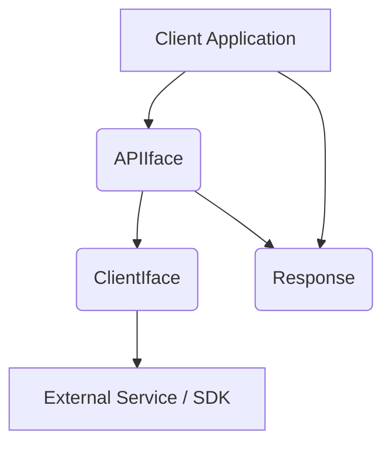
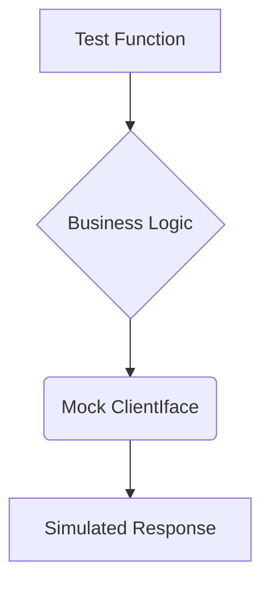

# Raymond's Notes: Developing and Testing SDK-Based Client Applications in Go

## 1. Introduction

This document provides a comprehensive guide to developing and testing Go client applications that interact with SDKs. It is based on the principles and patterns observed in the "Golang for DevOps and Cloud Engineers" course, with a focus on the `aws-s3-testing` and `http-login-tests` projects.

The key takeaway is the importance of a **three-layer interface architecture** and **dependency injection** to create modular, testable, and maintainable code.

## 2. Core Concepts: Three-Layer Interface Architecture

The three-layer interface architecture is a fundamental design pattern for building robust client applications. It separates the application into three distinct layers, each with a specific responsibility:

1.  **Transport Layer (`ClientIface`)**: This layer is responsible for the raw communication with the external service or SDK. It handles the details of the transport protocol (e.g., HTTP) and authentication.
2.  **Business Logic Layer (`APIIface`)**: This layer contains the core business logic of the application. It uses the Transport Layer to send and receive data and applies business rules to the data.
3.  **Presentation Layer (`Response`)**: This layer is responsible for formatting the data for presentation to the user or another system.

### 2.1. Diagram: Three-Layer Architecture



### 2.2. Why this architecture?

The instructor chose this architecture for several reasons:

*   **Separation of Concerns**: Each layer has a single, well-defined responsibility. This makes the code easier to understand, modify, and maintain.
*   **Testability**: By defining interfaces for each layer, we can easily mock the dependencies of a layer and test it in isolation. This is crucial for unit testing.
*   **Flexibility**: The implementation of each layer can be changed without affecting the other layers. For example, we could switch from a real HTTP client to a mock client for testing, or we could change the presentation format without touching the business logic.

## 3. Sequential Thinking: Developing a Client Application

Here is a step-by-step guide to developing a client application using the three-layer architecture:

### 3.1. Step 1: Define the Interfaces

The first step is to define the interfaces for each layer.

**Example from `http-login-tests`:**

*   **`ClientIface` (Transport Layer)**
    ```go
    // http-login-tests/pkg/api/get.go
    type ClientIface interface {
        Get(url string) (*http.Response, error)
        Post(url string, contentType string, body io.Reader) (*http.Response, error)
    }
    ```
*   **`APIIface` (Business Logic Layer)**
    ```go
    // http-login-tests/pkg/api/init.go
    type APIIface interface {
        DoGetRequest(requestURL string) (Response, error)
        Login(username, password string) error
    }
    ```
*   **`Response` (Presentation Layer)**
    ```go
    // http-login-tests/pkg/api/get.go
    type Response interface {
        GetResponse() string
    }
    ```

### 3.2. Step 2: Implement the Interfaces

Next, implement the interfaces.

**Example from `aws-s3-testing`:**

In `aws-s3-testing`, the interfaces are defined for the S3 client, uploader, and downloader.

```go
// aws-s3-testing/main.go
type S3Client interface {
	ListBuckets(ctx context.Context, params *s3.ListBucketsInput, optFns ...func(*s3.Options)) (*s3.ListBucketsOutput, error)
	CreateBucket(ctx context.Context, params *s3.CreateBucketInput, optFns ...func(*s3.Options)) (*s3.CreateBucketOutput, error)
}

type S3Uploader interface {
	Upload(ctx context.Context, input *s3.PutObjectInput, opts ...func(*manager.Uploader)) (*manager.UploadOutput, error)
}
type S3Downloader interface {
	Download(ctx context.Context, w io.WriterAt, input *s3.GetObjectInput, options ...func(*manager.Downloader)) (n int64, err error)
}
```

The actual implementation uses the AWS SDK for Go.

### 3.3. Step 3: Write Unit Tests with Mocks

With the interfaces in place, you can write unit tests using mock implementations.

**Example from `aws-s3-testing/main_test.go`:**

```go
// aws-s3-testing/main_test.go
type MockS3Client struct {
	ListBucketsOutput  *s3.ListBucketsOutput
	CreateBucketOutput *s3.CreateBucketOutput
}

func (m MockS3Client) ListBuckets(ctx context.Context, params *s3.ListBucketsInput, optFns ...func(*s3.Options)) (*s3.ListBucketsOutput, error) {
	return m.ListBucketsOutput, nil
}
func (m MockS3Client) CreateBucket(ctx context.Context, params *s3.CreateBucketInput, optFns ...func(*s3.Options)) (*s.CreateBucketOutput, error) {
	return m.CreateBucketOutput, nil
}

func TestCreateS3Bucket(t *testing.T) {
	ctx := context.Background()
	err := createS3Bucket(ctx, MockS3Client{
		ListBucketsOutput: &s3.ListBucketsOutput{
			Buckets: []types.Bucket{
				{
					Name: aws.String("test-bucket"),
				},
			},
		},
		CreateBucketOutput: &s3.CreateBucketOutput{},
	})
	if err != nil {
		t.Fatalf("createS3Bucket error: %s", err)
	}
}
```

### 3.4. Diagram: Testing with Mocks



### 3.5. Step 4: Implement the Main Application

Finally, implement the `main` function, where you will create concrete instances of your implementations and inject them.

**Example from `http-login-tests/cmd/main.go`:**

```go
// http-login-tests/cmd/main.go
func main() {
    // ...
    api := api.New(options)
    // ...
}
```

The `api.New` function creates a new `api` struct with a real `http.Client`.

## 4. Comparison: `aws-s3-testing` vs. `http-login-tests`

*   **`aws-s3-testing`** is a great example of how to use interfaces and dependency injection to test code that interacts with an SDK. Its flat structure is suitable for smaller projects.
*   **`http-login-tests`** demonstrates a more advanced, scalable architecture with its three-layer design and modular project structure. The use of a custom `http.RoundTripper` for JWT authentication is a notable feature.

Both projects highlight the importance of writing testable code by abstracting away external dependencies.

## 5. Python Equivalent

Here is how you could structure a similar application in Python, following the same design principles.

### 5.1. Project Structure

```
my_python_app/
├── my_app/
│   ├── __init__.py
│   ├── interfaces.py
│   ├── api.py
│   ├── client.py
│   └── models.py
├── tests/
│   ├── __init__.py
│   ├── test_api.py
│   └── mocks.py
└── main.py
```

### 5.2. Key Code Files

**`my_app/interfaces.py` (using Abstract Base Classes)**

```python
from abc import ABC, abstractmethod

class ClientInterface(ABC):
    @abstractmethod
    def get(self, url: str) -> dict:
        pass

class ApiInterface(ABC):
    @abstractmethod
    def do_get_request(self, url: str) -> 'ResponseInterface':
        pass

class ResponseInterface(ABC):
    @abstractmethod
    def get_response(self) -> str:
        pass
```

**`my_app/client.py`**

```python
import requests
from .interfaces import ClientInterface

class HttpClient(ClientInterface):
    def get(self, url: str) -> dict:
        response = requests.get(url)
        response.raise_for_status()
        return response.json()
```

**`my_app/api.py`**

```python
from .interfaces import ApiInterface, ClientInterface, ResponseInterface
from .models import MyResponse

class Api(ApiInterface):
    def __init__(self, client: ClientInterface):
        self.client = client

    def do_get_request(self, url: str) -> ResponseInterface:
        data = self.client.get(url)
        return MyResponse(data)
```

**`tests/test_api.py`**

```python
from .mocks import MockClient
from my_app.api import Api

def test_do_get_request():
    mock_client = MockClient(response_data={"key": "value"})
    api = Api(client=mock_client)
    response = api.do_get_request("http://fake-url.com")
    assert response.get_response() == "value"
```

This Python example mirrors the Go implementation's use of interfaces (via ABCs) and dependency injection, leading to a similarly testable and maintainable codebase.
