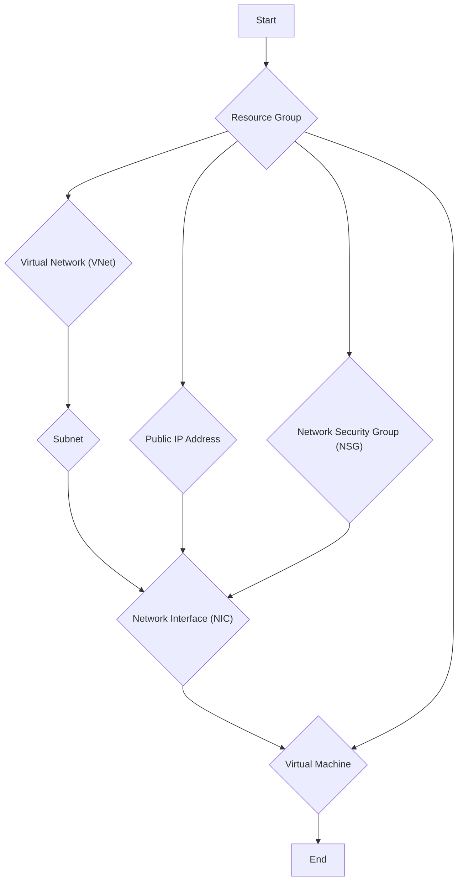
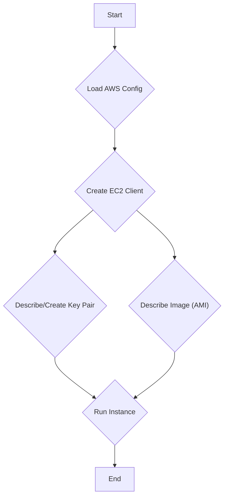
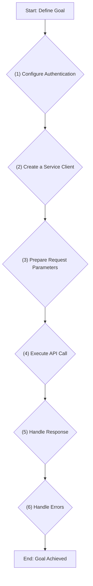

# Raymond's Notes 20: Azure vs. AWS Instance Creation

## 1. Introduction

This document provides a comparative analysis of creating virtual machine instances on Microsoft Azure and Amazon Web Services (AWS) using their respective Go SDKs. It examines the example projects `azure-instance` and `aws-ec2` to highlight the philosophical and practical differences between the two cloud providers. The goal is to understand the typical development workflow, resource management concepts, and SDK design patterns for each platform.

## 2. Azure Instance Creation Workflow

The Azure Go SDK demonstrates a more granular and explicit approach to resource management. To create a virtual machine, you must first provision a series of dependent resources, each as a distinct entity. This reflects Azure's philosophy of treating the cloud as a collection of interconnected, manageable components within a structured resource group.

### 2.1. Conceptual Flow and Resource Dependencies

The process of launching a VM in Azure involves creating a chain of resources. Each new resource often depends on one or more previously created resources.



### 2.2. Detailed Steps and Code Analysis

The `azure-instance/main.go` example follows a precise sequence to provision these resources.

#### Step 1: Authentication and Setup

Authentication is handled via `azidentity.NewAzureCLICredential`, which conveniently uses the credentials from the Azure CLI. This is a common pattern for development environments.

```go
// azure-instance/main.go

func getToken() (azcore.TokenCredential, error) {
	token, err := azidentity.NewAzureCLICredential(nil)
	if err != nil {
		return token, err
	}
	return token, nil
}
```

#### Step 2: Create a Resource Group

All resources in Azure must belong to a **Resource Group**, which is a logical container for grouping related resources for an application. This is a fundamental concept in Azure.

```go
// azure-instance/main.go

resourceGroupClient, err := armresources.NewResourceGroupsClient(subscriptionID, cred, nil)
// ...
resourceGroupParams := armresources.ResourceGroup{
    Location: to.Ptr(location),
}
resourcegroupResponse, err := resourceGroupClient.CreateOrUpdate(ctx, "go-azure-demo", resourceGroupParams, nil)
```

#### Step 3: Create Networking Resources

Before creating a VM, you must set up its network environment. This involves creating a VNet, Subnet, Public IP, and NSG.

-   **Virtual Network (VNet) and Subnet**: The VNet provides a private network for your Azure resources. A Subnet is a range of IP addresses within the VNet.

    ```go
    // azure-instance/main.go

    virtualNetworkClient, err := armnetwork.NewVirtualNetworksClient(subscriptionID, cred, nil)
    // ...
    vnetPollerResp, err := virtualNetworkClient.BeginCreateOrUpdate(
        // ...
    )
    vnetResponse, err := vnetPollerResp.PollUntilDone(ctx, nil)
    ```

-   **Public IP Address**: To make the VM accessible from the internet, a public IP address is required.

    ```go
    // azure-instance/main.go

    publicIPAddressClient, err := armnetwork.NewPublicIPAddressesClient(subscriptionID, cred, nil)
    // ...
    publicIPPollerResponse, err := publicIPAddressClient.BeginCreateOrUpdate(
        // ...
    )
    ```

-   **Network Security Group (NSG)**: The NSG acts as a firewall, controlling inbound and outbound traffic. Here, a rule is added to allow SSH access.

    ```go
    // azure-instance/main.go

    NewSecurityGroupsClient, err := armnetwork.NewSecurityGroupsClient(subscriptionID, cred, nil)
    // ...
    networkSecurityGroupPollerResponse, err := NewSecurityGroupsClient.BeginCreateOrUpdate(
        // ...
        Properties: &armnetwork.SecurityGroupPropertiesFormat{
            SecurityRules: []*armnetwork.SecurityRule{
                {
                    Name: to.Ptr("allow-ssh"),
                    Properties: &armnetwork.SecurityRulePropertiesFormat{
                        // ...
                        DestinationPortRange:     to.Ptr("22"),
                        Protocol:                 to.Ptr(armnetwork.SecurityRuleProtocolTCP),
                        Access:                   to.Ptr(armnetwork.SecurityRuleAccessAllow),
                        // ...
                    },
                },
            },
        },
        // ...
    )
    ```

#### Step 4: Create a Network Interface (NIC)

The NIC is what connects the VM to the VNet, Public IP, and NSG.

```go
// azure-instance/main.go

interfaceClient, err := armnetwork.NewInterfacesClient(subscriptionID, cred, nil)
// ...
nicPollerResponse, err := interfaceClient.BeginCreateOrUpdate(
    // ...
    Properties: &armnetwork.InterfacePropertiesFormat{
        NetworkSecurityGroup: &armnetwork.SecurityGroup{
            ID: networkSecurityGroupResponse.ID,
        },
        IPConfigurations: []*armnetwork.InterfaceIPConfiguration{
            {
                // ...
                Subnet: &armnetwork.Subnet{
                    ID: subnetResponse.ID,
                },
                PublicIPAddress: &armnetwork.PublicIPAddress{
                    ID: publicIPAddressResponse.ID,
                },
            },
        },
    },
    // ...
)
```

#### Step 5: Create the Virtual Machine

Finally, with all the dependencies in place, the VM can be created. The VM configuration references the NIC, and specifies the OS image, size, and admin credentials (using an SSH public key).

```go
// azure-instance/main.go

vmClient, err := armcompute.NewVirtualMachinesClient(subscriptionID, cred, nil)
// ...
parameters := armcompute.VirtualMachine{
    // ...
    Properties: &armcompute.VirtualMachineProperties{
        // ...
        OSProfile: &armcompute.OSProfile{
            ComputerName:  to.Ptr("go-demo"),
            AdminUsername: to.Ptr("demo"),
            LinuxConfiguration: &armcompute.LinuxConfiguration{
                DisablePasswordAuthentication: to.Ptr(true),
                SSH: &armcompute.SSHConfiguration{
                    PublicKeys: []*armcompute.SSHPublicKey{
                        {
                            Path:    to.Ptr(fmt.Sprintf("/home/%s/.ssh/authorized_keys", "demo")),
                            KeyData: pubKey,
                        },
                    },
                },
            },
        },
        NetworkProfile: &armcompute.NetworkProfile{
            NetworkInterfaces: []*armcompute.NetworkInterfaceReference{
                {
                    ID: nicResponse.ID,
                },
            },
        },
    },
}
pollerResponse, err := vmClient.BeginCreateOrUpdate(ctx, *resourcegroupResponse.Name, "go-demo", parameters, nil)
```

### 2.3. The "Poller" Pattern

A unique concept in the Azure SDK is the use of **pollers** for long-running operations. Creating resources like a VNet or a VM is not instantaneous. The SDK initiates the operation by calling a `BeginCreateOrUpdate` method, which returns a poller object. You then call `PollUntilDone` on this poller, which blocks until the operation is complete. This is a robust way to handle asynchronous operations on the cloud provider's side.

## 3. AWS EC2 Instance Creation Workflow

The AWS Go SDK (v2) presents a more streamlined, though less explicit, approach for creating a simple EC2 instance. Many of the networking and security defaults are handled implicitly by AWS if not specified. This reflects AWS's philosophy of providing a faster path to getting resources running, with the option to customize later.

### 3.1. Conceptual Flow

The process in the `aws-ec2` example is much more direct.



### 3.2. Detailed Steps and Code Analysis

The `aws-ec2/main.go` example demonstrates this more concise workflow.

#### Step 1: Authentication and Setup

Authentication is handled by `config.LoadDefaultConfig`, which automatically searches for credentials in a predefined order (environment variables, shared credentials file, etc.).

```go
// aws-ec2/main.go

cfg, err := config.LoadDefaultConfig(ctx, config.WithRegion(region))
if err != nil {
    return "", fmt.Errorf("LoadDefaultConfig error: %s", err)
}

ec2Client := ec2.NewFromConfig(cfg)
```

#### Step 2: Create or Verify a Key Pair

The code checks if a key pair named `go-aws-ec2` exists. If not, it creates one and saves the private key to a `.pem` file.

```go
// aws-ec2/main.go

existingKeyPairs, err := ec2Client.DescribeKeyPairs(ctx, &ec2.DescribeKeyPairsInput{
    KeyNames: []string{"go-aws-ec2"},
})
// ...
if existingKeyPairs == nil || len(existingKeyPairs.KeyPairs) == 0 {
    keyPair, err := ec2Client.CreateKeyPair(ctx, &ec2.CreateKeyPairInput{
        KeyName: aws.String("go-aws-ec2"),
    })
    // ...
    err = os.WriteFile("go-aws-ec2.pem", []byte(*keyPair.KeyMaterial), 0600)
    // ...
}
```

#### Step 3: Find an Amazon Machine Image (AMI)

The code searches for a specific Ubuntu AMI. The AMI ID is required to launch an instance.

```go
// aws-ec2/main.go

describeImages, err := ec2Client.DescribeImages(ctx, &ec2.DescribeImagesInput{
    Filters: []types.Filter{
        {
            Name:   aws.String("name"),
            Values: []string{"ubuntu/images/hvm-ssd/ubuntu-focal-20.04-amd64-server-*"},
        },
        // ...
    },
    Owners: []string{"099720109477"},
})
```

#### Step 4: Run the Instance

The `RunInstances` call creates the EC2 instance. Notice that networking details like VPC, subnet, and security groups are not specified. In this case, AWS will use the default VPC and its default security group.

```go
// aws-ec2/main.go

runInstance, err := ec2Client.RunInstances(ctx, &ec2.RunInstancesInput{
    ImageId:      describeImages.Images[0].ImageId,
    InstanceType: types.InstanceTypeT3Micro,
    KeyName:      aws.String("go-aws-ec2"),
    MinCount:     aws.Int32(1),
    MaxCount:     aws.Int32(1),
})
```

## 4. Key Differences: Azure vs. AWS

| Feature               | Azure                                                                                             | AWS                                                                                                     |
| --------------------- | ------------------------------------------------------------------------------------------------- | ------------------------------------------------------------------------------------------------------- |
| **Resource Grouping** | **Explicit and Mandatory**: All resources must be in a Resource Group.                            | **Implicit**: Resources are grouped by tags, VPCs, etc. No mandatory top-level container.               |
| **Networking**        | **Granular**: VNet, Subnet, NIC, Public IP, and NSG are all separate, configurable resources.      | **Consolidated**: VPC and Subnets are primary. EC2 instances can have public IPs and security groups attached directly. |
| **SDK Design**        | **Asynchronous with Pollers**: `Begin...` methods for long-running operations return a poller.      | **Synchronous-style**: API calls block until a response is received (though the operation may be async on the backend). |
| **Resource Naming**   | Resources are identified by name within a resource group.                                         | Resources are identified by unique IDs (e.g., `i-12345...`, `ami-abcde...`).                             |
| **Philosophy**        | **Infrastructure as Code**: Encourages defining every component of your infrastructure explicitly. | **Ease of Use**: Prioritizes getting started quickly with sensible defaults.                              |

## 5. Typical SDK Client Application Development Flow

Developing a client application with a cloud SDK, whether for Azure, AWS, or another provider, generally follows these steps:



1.  **Configure Authentication**: Set up credentials. This could be via environment variables, configuration files, or managed identities.
2.  **Create a Service Client**: Instantiate a client object for the service you want to interact with (e.g., `armcompute.NewVirtualMachinesClient` or `ec2.NewFromConfig`).
3.  **Prepare Request Parameters**: Create the struct or object that defines the resource you want to create or the action you want to perform. This is where you set properties like instance size, image ID, etc.
4.  **Execute API Call**: Call the appropriate method on the service client, passing the request parameters.
5.  **Handle Response**: Process the data returned from the API call. This could be an ID of a newly created resource, a list of existing resources, or a confirmation of success.
6.  **Handle Errors**: Always check for errors and handle them gracefully. Cloud operations can fail for many reasons (e.g., invalid permissions, resource limits, transient network issues).

## 6. Instructor's Coding Style

The instructor's code in these examples is **procedural and straightforward**. It's designed to clearly demonstrate the sequence of API calls required to achieve a specific outcome.

-   **Clarity over Abstraction**: The code avoids complex abstractions, interfaces, or design patterns. This is appropriate for educational examples focused on the SDK's direct usage.
-   **Error Handling**: Errors are handled immediately after each API call with a simple `if err != nil`, which is a standard Go idiom.
-   **Linear Flow**: The `main` function in both projects reads like a script, executing one step after another. This makes it easy to follow the resource creation process.

In a production application, you would likely wrap this logic in a more structured way, perhaps using the **three-layer interface design** mentioned in the project's `copilot-instructions.md` if this were part of a larger service. However, for a standalone infrastructure provisioning script, this direct style is effective.

## 7. Python Implementation

Here’s how you might structure an equivalent application in Python.

### 7.1. Project Structure

```
python-cloud-clients/
├── aws_instance/
│   ├── __init__.py
│   ├── main.py
│   └── requirements.txt
├── azure_instance/
│   ├── __init__.py
│   ├── main.py
│   └── requirements.txt
└── README.md
```

### 7.2. Key Code Files

#### Azure with Python

The Python SDK for Azure also follows a similar resource-centric model.

```python
# azure_instance/requirements.txt
azure-identity
azure-mgmt-resource
azure-mgmt-network
azure-mgmt-compute
```

```python
# azure_instance/main.py
import os
from azure.identity import AzureCliCredential
from azure.mgmt.resource import ResourceManagementClient
from azure.mgmt.network import NetworkManagementClient
from azure.mgmt.compute import ComputeManagementClient

def main():
    subscription_id = os.environ["AZURE_SUBSCRIPTION_ID"]
    location = "westus"
    resource_group_name = "py-azure-demo"
    
    credential = AzureCliCredential()
    
    resource_client = ResourceManagementClient(credential, subscription_id)
    network_client = NetworkManagementClient(credential, subscription_id)
    compute_client = ComputeManagementClient(credential, subscription_id)

    # 1. Create Resource Group
    rg_result = resource_client.resource_groups.create_or_update(
        resource_group_name, {"location": location}
    )
    print(f"Provisioned resource group {rg_result.name}")

    # ... (Steps for VNet, Subnet, Public IP, NSG, NIC would follow) ...

    # 2. Create VM (simplified for brevity)
    # In a real script, you would create all the networking components first,
    # just like in the Go example.
    
    print("Azure VM creation process would be detailed here.")

if __name__ == "__main__":
    main()
```

#### AWS with Python

The `boto3` library is the standard for Python and AWS.

```python
# aws_instance/requirements.txt
boto3
```

```python
# aws_instance/main.py
import boto3

def main():
    region = "us-east-1"
    key_name = "py-aws-ec2"
    
    ec2_client = boto3.client("ec2", region_name=region)
    
    # 1. Describe or Create Key Pair (simplified)
    try:
        ec2_client.describe_key_pairs(KeyNames=[key_name])
        print(f"Key pair '{key_name}' already exists.")
    except ec2_client.exceptions.ClientError as e:
        if "InvalidKeyPair.NotFound" in str(e):
            print(f"Creating key pair '{key_name}'...")
            key_pair = ec2_client.create_key_pair(KeyName=key_name)
            # In a real app, save key_pair['KeyMaterial'] to a file
        else:
            raise

    # 2. Find AMI
    response = ec2_client.describe_images(
        Owners=['099720109477'],
        Filters=[
            {'Name': 'name', 'Values': ['ubuntu/images/hvm-ssd/ubuntu-focal-20.04-amd64-server-*']},
            {'Name': 'virtualization-type', 'Values': ['hvm']}
        ]
    )
    ami_id = response['Images'][0]['ImageId']
    
    # 3. Run Instance
    instance_response = ec2_client.run_instances(
        ImageId=ami_id,
        InstanceType='t3.micro',
        KeyName=key_name,
        MinCount=1,
        MaxCount=1
    )
    
    instance_id = instance_response['Instances'][0]['InstanceId']
    print(f"Successfully launched EC2 instance {instance_id} with AMI {ami_id}")

if __name__ == "__main__":
    main()
```
