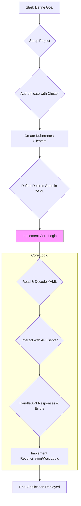
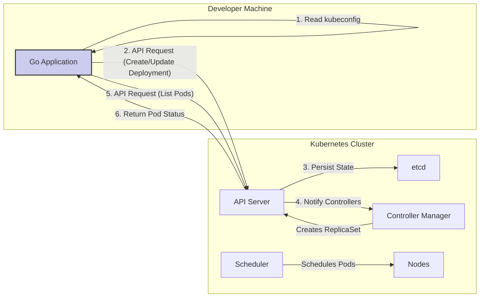

# Developing Kubernetes Client Applications in Go

This document provides a comprehensive reference for developing Kubernetes client applications using the official Go SDK. It is based on the example project `kubernetes-deploy` and explores the methodologies, design patterns, and philosophies that align with modern cloud-native development.

## 1. The Kubernetes Philosophy in Practice

The `kubernetes-deploy` project, while simple, embodies several core principles of the Kubernetes philosophy:

*   **Declarative Configuration:** The desired state of the application is declared in a YAML file (`app.yaml`). The Go application's role is to act as a controller that enforces this state within the cluster. This is the cornerstone of Kubernetes: you define *what* you want, and the system works to achieve it.
*   **API-Centric Design:** All interactions with the cluster are performed through the Kubernetes API server. The Go client is a consumer of this API, demonstrating the primary way to programmatically manage Kubernetes resources.
*   **Controller Pattern:** The application follows a simplified controller/operator pattern:
    1.  **Observe:** It checks the current state of the system (e.g., does the deployment exist?).
    2.  **Diff:** It compares the current state with the desired state from `app.yaml`.
    3.  **Act:** It takes action to reconcile the difference (e.g., create or update the deployment).
    The `waitForPods` function is a basic reconciliation loop, continuously checking the pod status until the desired state (all pods running) is met.

## 2. The Development Workflow: A Sequential Approach

Developing a Kubernetes client application in Go follows a logical progression. Understanding this sequence is key to building robust and maintainable applications.

### Workflow Diagram



### Step-by-Step Breakdown

1.  **Define the Goal:** Clearly identify what you want to achieve. For example, "Deploy and manage a web server application defined by a Kubernetes Deployment object."

2.  **Project Setup:** Initialize your Go module and add the necessary dependencies.
    ```bash
    go mod init my-k8s-app
    go get k8s.io/client-go@v0.23.5
    go get k8s.io/api@v0.23.5
    go get k8s.io/apimachinery@v0.23.5
    ```

3.  **Authenticate with the Cluster:** Your application needs credentials to communicate with the API server. There are two primary methods:
    *   **Out-of-Cluster:** For applications running outside the Kubernetes cluster (e.g., on a developer's machine). It uses a `kubeconfig` file.
    *   **In-Cluster:** For applications running as pods within the cluster. It uses a service account token automatically mounted into the pod.

    The `kubernetes-deploy` example uses the out-of-cluster method, which is ideal for development and CLI tools.

4.  **Create the `clientset`:** The `clientset` is your main entry point for interacting with the Kubernetes API. It's a collection of clients for different API groups and versions (e.g., `AppsV1`, `CoreV1`).

5.  **Implement the Core Logic:**
    *   **Read and Decode YAML:** Load your declarative manifest from a file and decode it into a Go struct that represents the Kubernetes object.
    *   **Interact with the API Server:** Use the `clientset` to perform CRUD (Create, Read, Update, Delete) operations on resources.
    *   **Handle Errors:** Be prepared to handle API errors, such as `errors.IsNotFound(err)`, to determine if a resource already exists.
    *   **Wait for Completion (Reconciliation):** If your application needs to wait for a resource to reach a certain state, implement a polling loop.

## 3. Architectural Overview

The interaction between the Go application and the Kubernetes cluster can be visualized as follows:



## 4. Code Implementation Deep Dive

Let's examine key snippets from `kubernetes-deploy/main.go` to understand the implementation details.

### 4.1. Getting the Client (Out-of-Cluster)

The `getClient` function is responsible for setting up authentication using the local kubeconfig file.

```go
// kubernetes-deploy/main.go

func getClient() (*kubernetes.Clientset, error) {
	// use the current context in kubeconfig
	config, err := clientcmd.BuildConfigFromFlags("", filepath.Join(homedir.HomeDir(), ".kube", "config"))
	if err != nil {
		return nil, err
	}

	// create the clientset
	clientset, err := kubernetes.NewForConfig(config)
	if err != nil {
		return nil, err
	}
	return clientset, nil
}
```
*   **Instructor's Rationale:** This function encapsulates the logic for creating a client. By using `clientcmd.BuildConfigFromFlags`, the instructor makes the application easy to run in a local development environment without hardcoding credentials. For an application intended to run inside a cluster, you would use `rest.InClusterConfig()`.

### 4.2. Deploying the Application

The `deploy` function is the heart of the application. It reads the `app.yaml`, decodes it, and then creates or updates the deployment.

```go
// kubernetes-deploy/main.go

func deploy(ctx context.Context, client *kubernetes.Clientset) (map[string]string, int32, error) {
	var deployment *v1.Deployment

	appFile, err := ioutil.ReadFile("app.yaml")
	if err != nil {
		return nil, 0, fmt.Errorf("readfile error: %s", err)
	}

	// Decode the YAML to a Kubernetes object
	obj, groupVersionKind, err := scheme.Codecs.UniversalDeserializer().Decode(appFile, nil, nil)
	if err != nil {
		return nil, 0, fmt.Errorf("Decode error: %s", err)
	}

	// Type assertion to ensure we have a Deployment
	switch obj.(type) {
	case *v1.Deployment:
		deployment = obj.(*v1.Deployment)
	default:
		return nil, 0, fmt.Errorf("Unrecognized type: %s", groupVersionKind)
	}

	// Check if the deployment already exists
	_, err = client.AppsV1().Deployments("default").Get(ctx, deployment.Name, metav1.GetOptions{})
	if err != nil && errors.IsNotFound(err) {
		// Create the deployment if it does not exist
		deploymentResponse, err := client.AppsV1().Deployments("default").Create(ctx, deployment, metav1.CreateOptions{})
		if err != nil {
			return nil, 0, fmt.Errorf("deployment error: %s", err)
		}
		return deploymentResponse.Spec.Template.Labels, *deploymentResponse.Spec.Replicas, nil
	} else if err != nil && !errors.IsNotFound(err) {
		return nil, 0, fmt.Errorf("deployment get error: %s", err)
	}

	// Update the deployment if it already exists
	deploymentResponse, err := client.AppsV1().Deployments("default").Update(ctx, deployment, metav1.UpdateOptions{})
	if err != nil {
		return nil, 0, fmt.Errorf("deployment error: %s", err)
	}
	return deploymentResponse.Spec.Template.Labels, *deploymentResponse.Spec.Replicas, nil
}
```
*   **Instructor's Rationale:** This function demonstrates a critical pattern: **Create-or-Update**. It first tries to `Get` the resource. If it receives a `NotFound` error, it proceeds to `Create` it. Otherwise, it `Update`s the existing resource. This makes the operation idempotent, a key characteristic of reliable automation. The use of `scheme.Codecs.UniversalDeserializer().Decode` is the standard, robust way to handle Kubernetes YAML.

### 4.3. Waiting for Pods to be Ready

The `waitForPods` function implements a simple polling mechanism to check the status of the pods managed by the deployment.

```go
// kubernetes-deploy/main.go

func waitForPods(ctx context.Context, client *kubernetes.Clientset, deploymentLabels map[string]string, expectedPods int32) error {
	for {
		validatedLabels, err := labels.ValidatedSelectorFromSet(deploymentLabels)
		if err != nil {
			return fmt.Errorf("ValidatedSelectorFromSet error: %s", err)
		}

		// List pods matching the deployment's labels
		podList, err := client.CoreV1().Pods("default").List(ctx, metav1.ListOptions{
			LabelSelector: validatedLabels.String(),
		})
		if err != nil {
			return fmt.Errorf("pod list error: %s", err)
		}

		podsRunning := 0
		for _, pod := range podList.Items {
			if pod.Status.Phase == "Running" {
				podsRunning++
			}
		}

		fmt.Printf("Waiting for pods to become ready (running %d / %d)\n", podsRunning, len(podList.Items))

		if podsRunning > 0 && podsRunning == len(podList.Items) && podsRunning == int(expectedPods) {
			break // Exit loop when all expected pods are running
		}

		time.Sleep(5 * time.Second)
	}
	return nil
}
```
*   **Instructor's Rationale:** This function highlights the importance of **label selectors** for finding related resources. Instead of tracking individual pods, it uses the labels defined in the deployment's template to query for all associated pods. This is a loosely coupled and highly scalable pattern. While simple polling is shown here, more advanced applications would use the `watch` API for more efficient, event-driven updates.

## 5. Python Implementation Equivalence

The same application can be built using the official Kubernetes Python client. The principles remain identical, only the syntax changes.

### 5.1. Python Project Structure

```
k8s-python-deploy/
├── app.yaml
├── main.py
└── requirements.txt
```

### 5.2. Key Python Code (`main.py`)

```python
import yaml
import time
from kubernetes import client, config
from kubernetes.client.rest import ApiException

def main():
    # Load kubeconfig
    config.load_kube_config()

    # Create API clients
    apps_v1 = client.AppsV1Api()
    core_v1 = client.CoreV1Api()

    # Load and parse the deployment YAML
    with open("app.yaml", "r") as f:
        deployment_manifest = yaml.safe_load(f)

    namespace = "default"
    deployment_name = deployment_manifest["metadata"]["name"]

    try:
        # Try to get the deployment
        apps_v1.read_namespaced_deployment(name=deployment_name, namespace=namespace)
        print(f"Deployment '{deployment_name}' already exists. Updating...")
        # Update the deployment
        api_response = apps_v1.patch_namespaced_deployment(
            name=deployment_name,
            namespace=namespace,
            body=deployment_manifest
        )
    except ApiException as e:
        if e.status == 404:
            print(f"Deployment '{deployment_name}' not found. Creating...")
            # Create the deployment
            api_response = apps_v1.create_namespaced_deployment(
                namespace=namespace,
                body=deployment_manifest
            )
        else:
            raise

    print("Deployment created/updated. Waiting for pods to be ready...")
    
    # Wait for pods
    wait_for_pods(core_v1, namespace, deployment_manifest["spec"]["selector"]["matchLabels"], deployment_manifest["spec"]["replicas"])

def wait_for_pods(api_instance, namespace, labels, expected_replicas):
    label_selector = ",".join([f"{k}={v}" for k, v in labels.items()])
    while True:
        try:
            pod_list = api_instance.list_namespaced_pod(
                namespace=namespace,
                label_selector=label_selector
            )
            
            running_pods = 0
            for pod in pod_list.items:
                if pod.status.phase == "Running":
                    running_pods += 1
            
            print(f"Waiting for pods... Running: {running_pods}/{expected_replicas}")

            if running_pods == expected_replicas:
                print("All pods are running.")
                break

        except ApiException as e:
            print(f"Error listing pods: {e}")

        time.sleep(5)

if __name__ == "__main__":
    main()

```
This Python version mirrors the Go application's logic, demonstrating that the core concepts of interacting with the Kubernetes API are language-agnostic.
