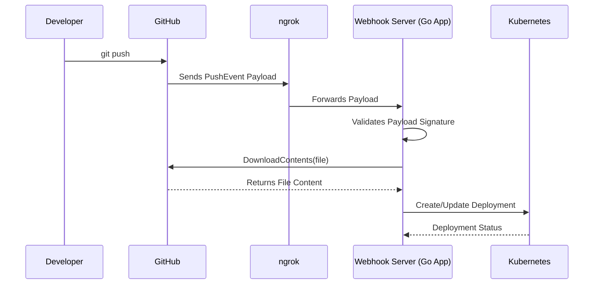
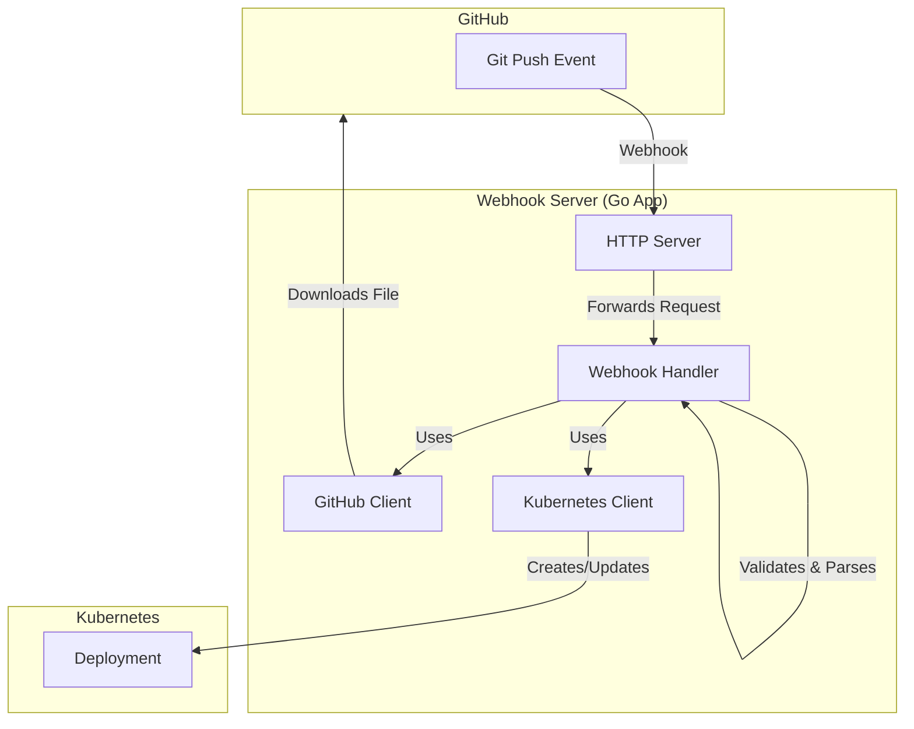

# GitHub Webhooks and Kubernetes Deployment

## 1. What are GitHub Webhooks?

GitHub Webhooks provide a way for GitHub to send real-time notifications to an external web server whenever a specific event occurs in a repository. These events can include actions like `push` (when code is pushed to a repository), `pull_request` (when a pull request is opened or updated), `issues` (when an issue is created or modified), and many more.

By using webhooks, you can build applications that listen for these events and automate workflows. A common use case, as demonstrated in this example, is to trigger a Continuous Integration/Continuous Deployment (CI/CD) pipeline. When new code is pushed, a webhook can notify a deployment server to automatically build and deploy the changes.

## 2. Development Process for a GitHub Webhook Application

Developing an application that consumes GitHub webhooks involves a clear, sequential process. The goal is to create a secure and reliable endpoint that can receive, validate, and process event payloads from GitHub.

### 2.1. Development Workflow Diagram

This diagram illustrates the end-to-end flow, from a developer pushing code to the application being deployed in Kubernetes.



### 2.2. Step-by-Step Development Process

1.  **Create an HTTP Endpoint:** The first step is to create an HTTP server with a specific endpoint (e.g., `/webhook`) that will receive the POST requests from GitHub.

2.  **Handle the Webhook Payload:**
    *   **Validation:** For security, GitHub signs each webhook payload with a secret key. Your application **must** validate this signature to ensure the request is genuinely from GitHub. The `github.ValidatePayload` function in the Go SDK handles this.
    *   **Parsing:** Once validated, the JSON payload needs to be parsed into a corresponding event object (e.g., `github.PushEvent`). The `github.ParseWebHook` function helps with this.

3.  **Implement Business Logic:** Based on the event type, you implement your application's logic. In this example, for a `PushEvent`, the logic is:
    *   Identify the added or modified files from the commits.
    *   Use the GitHub API to download the contents of these files.
    *   Use the Kubernetes API to apply the downloaded configuration.

4.  **Local Development with `ngrok`:** During development, your local server is not accessible from the public internet. `ngrok` is a tool that creates a secure tunnel from a public URL to your local machine. You provide this `ngrok` URL to GitHub, which then forwards the webhook events to your local server, allowing you to test your application without deploying it.

5.  **Deployment:** Once the application is tested, it can be deployed to a public server or a Kubernetes cluster. The application needs to be configured with the necessary credentials (GitHub token, webhook secret) to function correctly.

## 3. The Role of `ngrok`

In the context of this project, **`ngrok` is a development tool used to expose a local web server to the internet.**

*   **Why is it needed?** GitHub's servers need to send a POST request to your application's webhook endpoint. If your application is running on `localhost:8080`, GitHub cannot reach it.
*   **How it works:** You run `ngrok http 8080`, and it provides you with a public URL (e.g., `https://random-string.ngrok.io`). You then configure this URL in your GitHub repository's webhook settings. Now, any event from GitHub is sent to the `ngrok` URL, which securely tunnels it to your local server.

This allows for rapid iteration and debugging of the webhook handler before deploying the application to a production environment.

## 4. Where the Application Runs

The application is designed to be flexible and can run in two environments:

1.  **Locally for Development:** The `getClient` function in `main.go` checks if it's running inside a cluster. If not, it uses the local Kubernetes configuration file (`~/.kube/config`) to communicate with a Kubernetes cluster. This is ideal for development and testing from a local machine.

    ```go
    // main.go
    func getClient(ctx context.Context, inCluster bool) (*kubernetes.Clientset, error) {
        // ...
        if inCluster {
            config, err = rest.InClusterConfig()
            // ...
        } else {
            kubeConfigPath := filepath.Join(homedir.HomeDir(), ".kube", "config")
            config, err = clientcmd.BuildConfigFromFlags("", kubeConfigPath)
            // ...
        }
        // ...
    }
    ```

2.  **Inside a Kubernetes Cluster:** The `deploy.yaml` file defines the Kubernetes resources (Deployment, Service, ServiceAccount, etc.) to run the application within a cluster. When deployed in a cluster, the application uses `rest.InClusterConfig()` to automatically configure the Kubernetes client to communicate with the Kubernetes API server from within the pod.

    ```yaml
    # deploy.yaml
    apiVersion: apps/v1
    kind: Deployment
    metadata:
      name: github-deploy
    spec:
      # ...
      containers:
      - name: github-deploy
        image: wardviaene/github-deploy
    # ...
    ```

## 5. Code Explanation and Architecture

The instructor's code follows modern Go practices, emphasizing separation of concerns and robust error handling.

### 5.1. Architecture Overview



### 5.2. Key Code Snippets

#### `main.go`: Initialization

The `main` function initializes the Kubernetes and GitHub clients and starts the HTTP server. The clients are passed to the `server` struct, demonstrating dependency injection.

```go
// main.go
func main() {
    // ...
	ctx := context.Background()
	if client, err = getClient(ctx, false); err != nil {
		fmt.Printf("Error: %s\n", err)
		os.Exit(1)
	}
	serverInstance := server{
		client:           client,
		webhookSecretKey: os.Getenv("WEBHOOK_SECRET"),
		githubClient:     getGitHubClient(ctx, os.Getenv("GITHUB_TOKEN")),
	}

	http.HandleFunc("/webhook", serverInstance.webhook)

	err = http.ListenAndServe(":8080", nil)
	fmt.Printf("Exited: %s\n", err)
}
```

#### `server.go`: Webhook Handler

The `webhook` function is the core of the application. It validates the payload, parses the event, and then acts on it. The use of a `switch` statement on the event type allows for handling different kinds of webhooks.

```go
// server.go
func (s server) webhook(w http.ResponseWriter, req *http.Request) {
	ctx := context.Background()
	payload, err := github.ValidatePayload(req, []byte(s.webhookSecretKey))
	if err != nil {
		// ...
		return
	}
	event, err := github.ParseWebHook(github.WebHookType(req), payload)
	if err != nil {
		// ...
		return
	}
	switch event := event.(type) {
	case *github.PushEvent:
		files := getFiles(event.Commits)
		for _, filename := range files {
			downloadedFile, _, err := s.githubClient.Repositories.DownloadContents(ctx, *event.Repo.Owner.Name, *event.Repo.Name, filename, &github.RepositoryContentGetOptions{})
			// ...
			fileBody, err := io.ReadAll(downloadedFile)
			// ...
			_, _, err = deploy(ctx, s.client, fileBody)
			// ...
		}
	// ...
	}
}
```

#### `main.go`: Deployment Logic

The `deploy` function takes the Kubernetes client and the file content. It decodes the YAML file into a Kubernetes `Deployment` object and then uses the client to either create a new deployment or update an existing one.

```go
// main.go
func deploy(ctx context.Context, client *kubernetes.Clientset, appFile []byte) (map[string]string, int32, error) {
	var deployment *v1.Deployment

	obj, groupVersionKind, err := scheme.Codecs.UniversalDeserializer().Decode(appFile, nil, nil)
	// ...

	switch obj.(type) {
	case *v1.Deployment:
		deployment = obj.(*v1.Deployment)
	default:
		return nil, 0, fmt.Errorf("Unrecognized type: %s\n", groupVersionKind)
	}

	_, err = client.AppsV1().Deployments("default").Get(ctx, deployment.Name, metav1.GetOptions{})
	if err != nil && errors.IsNotFound(err) {
		// Create deployment if it does not exist
		deploymentResponse, err := client.AppsV1().Deployments("default").Create(ctx, deployment, metav1.CreateOptions{})
		// ...
	} else if err != nil {
		// ...
	}

    // Update deployment if it exists
	deploymentResponse, err := client.AppsV1().Deployments("default").Update(ctx, deployment, metav1.UpdateOptions{})
	// ...
	return deploymentResponse.Spec.Template.Labels, *deploymentResponse.Spec.Replicas, nil
}
```

## 6. Python Equivalent Implementation

A similar application can be built in Python using the Flask web framework, the `PyGithub` library for the GitHub API, and the `kubernetes` Python client.

### 6.1. Project Structure

```
/python-github-deploy
|-- app.py
|-- requirements.txt
|-- Dockerfile
|-- .env
```

### 6.2. Key Code (`app.py`)

This Python code provides an equivalent implementation to the Go application. It uses Flask to create the web server, validates the webhook signature, and uses the respective clients for GitHub and Kubernetes.

```python
import os
import hmac
import hashlib
from flask import Flask, request, abort
from github import Github
from kubernetes import client, config
import yaml

app = Flask(__name__)

# Load environment variables
GITHUB_TOKEN = os.getenv("GITHUB_TOKEN")
WEBHOOK_SECRET = os.getenv("WEBHOOK_SECRET")

# Initialize GitHub client
g = Github(GITHUB_TOKEN)

# Configure Kubernetes client
try:
    config.load_incluster_config()
except config.ConfigException:
    config.load_kube_config()

k8s_apps_v1 = client.AppsV1Api()

@app.route('/webhook', methods=['POST'])
def webhook():
    # 1. Validate the webhook signature
    signature = request.headers.get('X-Hub-Signature')
    if not signature:
        abort(400, 'Missing signature')

    sha_name, signature = signature.split('=')
    if sha_name != 'sha1':
        abort(501, 'Unsupported signature algorithm')

    mac = hmac.new(WEBHOOK_SECRET.encode(), msg=request.data, digestmod=hashlib.sha1)
    if not hmac.compare_digest(mac.hexdigest(), signature):
        abort(400, 'Invalid signature')

    # 2. Process the event
    if request.headers.get('X-GitHub-Event') == 'push':
        payload = request.get_json()
        repo_name = payload['repository']['full_name']
        repo = g.get_repo(repo_name)

        for commit in payload['commits']:
            # Get added and modified files
            files = commit.get('added', []) + commit.get('modified', [])
            for filename in files:
                if filename.endswith('.yaml') or filename.endswith('.yml'):
                    try:
                        content = repo.get_contents(filename, ref=payload['ref'])
                        deploy_to_k8s(content.decoded_content)
                    except Exception as e:
                        print(f"Error processing file {filename}: {e}")
                        return "Error processing file", 500
        return "Push event processed", 200

    return "Event not processed", 200

def deploy_to_k8s(file_content):
    try:
        deployment_yaml = yaml.safe_load(file_content)
        deployment_name = deployment_yaml['metadata']['name']
        namespace = deployment_yaml.get('metadata', {}).get('namespace', 'default')

        try:
            # Check if deployment exists
            k8s_apps_v1.read_namespaced_deployment(name=deployment_name, namespace=namespace)
            # Update deployment
            k8s_apps_v1.replace_namespaced_deployment(
                name=deployment_name,
                namespace=namespace,
                body=deployment_yaml
            )
            print(f"Deployment '{deployment_name}' updated.")
        except client.ApiException as e:
            if e.status == 404:
                # Create deployment
                k8s_apps_v1.create_namespaced_deployment(
                    namespace=namespace,
                    body=deployment_yaml
                )
                print(f"Deployment '{deployment_name}' created.")
            else:
                raise e
    except Exception as e:
        print(f"Error deploying to Kubernetes: {e}")
        raise

if __name__ == '__main__':
    app.run(host='0.0.0.0', port=8080)

```

### 6.3. `requirements.txt`

```
Flask==2.2.2
PyGithub==1.55
kubernetes==24.2.0
PyYAML==6.0
```
