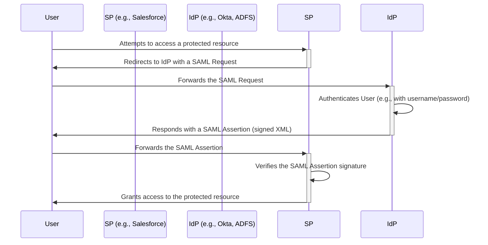
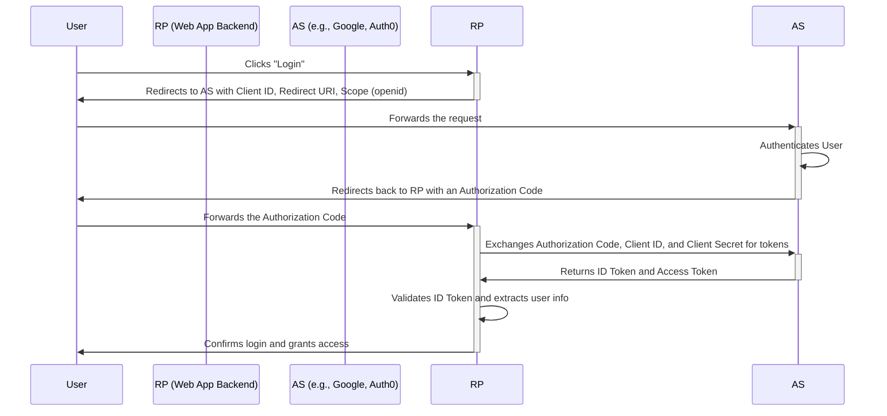
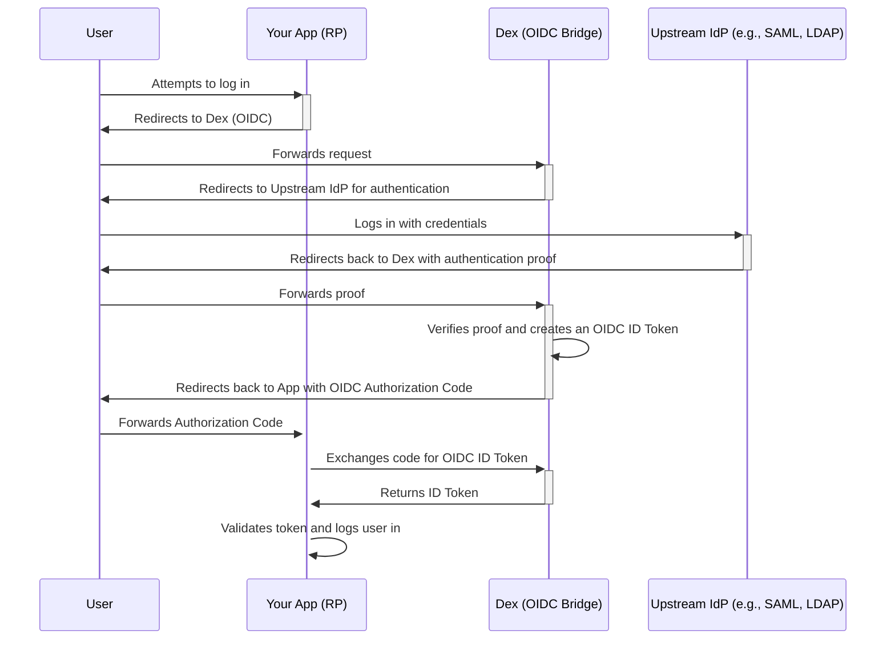

# A Developer's Guide to SAML, OIDC, and Modern Authentication

This document provides a comprehensive comparison between two cornerstone authentication protocols, SAML and OIDC. It also explores modern identity provider mechanisms within the Golang ecosystem, offering a well-structured overview of workflows and technical concepts.

## 1. Introduction to Identity Providers (IdP) and Single Sign-On (SSO)

An **Identity Provider (IdP)** is a system entity that creates, maintains, and manages identity information for principals while providing authentication services to relying applications within a federation or distributed network. In simple terms, it's a trusted service that manages a user's digital identity.

**Single Sign-On (SSO)** is a direct application of this concept. It's an authentication scheme that allows a user to log in with a single set of credentials to multiple independent software systems. The IdP is the central component that makes SSO possible, authenticating the user once and then vouching for their identity to various applications.

Two of the most prevalent protocols that enable SSO are **Security Assertion Markup Language (SAML)** and **OpenID Connect (OIDC)**.

## 2. Deep Dive: Security Assertion Markup Language (SAML 2.0)

SAML is an open standard for exchanging authentication and authorization data between parties, in particular, between an identity provider and a service provider. Released in 2005, SAML is a mature, robust, and widely adopted standard, especially in enterprise environments.

### Key Concepts

*   **Identity Provider (IdP):** The service that authenticates the user and sends identity assertions to the Service Provider.
*   **Service Provider (SP):** The application or website that the user wants to access. It trusts the IdP to authenticate users.
*   **SAML Assertion:** An XML document that the IdP sends to the SP. It contains statements about the user, such as their username, email, and any other relevant attributes. Assertions are digitally signed to ensure their integrity and authenticity.

### SAML Workflow (SP-Initiated Flow)

The most common SAML workflow is initiated by the Service Provider.

### Pros and Cons of SAML

**Pros:**

*   **Mature and Widely Adopted:** Strong presence in enterprise and government systems.
*   **Standardized:** Well-defined and robust specification.
*   **Decoupling of Identity:** Excellent for separating identity management from service logic.

**Cons:**

*   **Complexity:** The XML-based format and verbose specifications can be difficult to implement and debug.
*   **Not Mobile-Friendly:** Designed for traditional web browser flows, making it cumbersome for native mobile and single-page applications (SPAs).
*   **Heavyweight:** XML parsing is more resource-intensive compared to JSON.

## 3. Deep Dive: OpenID Connect (OIDC)

OIDC is a simple identity layer built on top of the **OAuth 2.0** protocol. Launched in 2014, it was designed to be more developer-friendly, lightweight, and better suited for modern applications, including mobile and SPAs.

While OAuth 2.0 is a framework for *authorization* (granting access to resources), OIDC is for *authentication* (verifying a user's identity).

### Key Concepts

*   **Authorization Server (AS):** The OIDC-compliant Identity Provider. It authenticates the user and issues tokens.
*   **Relying Party (RP):** The application that requests authentication of a user from the Authorization Server. This is the equivalent of SAML's Service Provider.
*   **ID Token:** A JSON Web Token (JWT) that contains claims about the authentication event (e.g., who the user is, when they authenticated). This is the core of OIDC's authentication mechanism.
*   **Access Token:** An OAuth 2.0 token that the RP can use to access protected resources on behalf of the user (e.g., call an API).

### OIDC Workflow (Authorization Code Flow)

This is the most common and secure OIDC flow, ideal for web applications with a backend.

### Pros and Cons of OIDC

**Pros:**

*   **Modern and Lightweight:** Uses JSON and REST, making it easy for developers to work with.
*   **Mobile and SPA Friendly:** Designed from the ground up to support various client types.
*   **Built on OAuth 2.0:** Leverages a mature and widely understood authorization framework.
*   **Rich Information:** ID Tokens (JWTs) are self-contained and easy to parse for user information.

**Cons:**

*   **Less Enterprise Penetration (Historically):** While growing rapidly, SAML still dominates in many legacy enterprise systems.
*   **Flow Complexity:** The variety of flows (Implicit, Hybrid) can be confusing for newcomers.

## 4. SAML vs. OIDC: A Head-to-Head Comparison

| Feature             | SAML 2.0                               | OIDC                                                 |
| ------------------- | -------------------------------------- | ---------------------------------------------------- |
| **Released**        | 2005                                   | 2014                                                 |
| **Data Format**     | XML, SOAP                              | JSON, REST                                           |
| **Tokens**          | SAML Assertions (XML)                  | ID Tokens & Access Tokens (JWT)                      |
| **Complexity**      | High                                   | Low to Medium                                        |
| **Primary Use Case**| Enterprise Web SSO                     | Web, Mobile, and SPA SSO                             |
| **Signature**       | XML Digital Signature                  | JSON Web Signature (JWS)                             |
| **API Support**     | Limited (primarily for web redirects)  | Excellent (built on OAuth 2.0 for API authorization) |

## 5. Modern Identity Management in the Golang Ecosystem

Golang's strong standard library and performance make it an excellent choice for building identity services. While you can implement OIDC flows from scratch, several open-source projects provide robust, production-ready solutions.

### Key Libraries and Frameworks

1.  **`golang.org/x/oauth2` and `coreos/go-oidc`**
    *   **Purpose:** These are the de-facto standard libraries for *client-side* OIDC and OAuth 2.0 implementations in Go.
    *   **Use Case:** When you are building a Relying Party (a web application) that needs to authenticate users against an existing OIDC provider like Google, Okta, or Auth0. The `oauth2` package handles the token exchange, and `go-oidc` provides verification for the ID Token.

2.  **Ory Hydra**
    *   **Purpose:** A certified, API-driven, and headless OAuth 2.0 and OIDC provider. "Headless" means Hydra provides the core logic but does not handle user interfaces for login, consent, or user management.
    *   **Use Case:** When you need to build your own full-featured, scalable, and compliant Authorization Server. You build the UI and user management, and Hydra handles the complex OAuth/OIDC protocol logic. This is ideal for creating a centralized authentication service for your organization's applications.

3.  **Dex**
    *   **Purpose:** An identity service that uses OIDC to drive authentication for other apps. Its key feature is its ability to act as an "identity bridge."
    *   **Use Case:** When you need to provide a single, consistent OIDC interface to applications while connecting to various backend identity providers (like SAML, LDAP, GitHub, or other OIDC providers). Dex is perfect for unifying authentication across a diverse set of legacy and modern identity systems. For example, you can use Dex to allow your Kubernetes cluster to authenticate users via a corporate SAML provider.

### Modern Authentication Workflow with Dex as a Bridge

## 6. Conclusion

*   **SAML** remains a powerful and relevant standard, especially for enterprise web applications, but its complexity and age show.
*   **OIDC** is the modern, developer-friendly successor, built on the shoulders of OAuth 2.0. It is the preferred choice for new development, especially for mobile and API-centric architectures.
*   The **Golang ecosystem** provides powerful tools for both consuming and providing identity services. For client-side needs, the standard `x/oauth2` and `go-oidc` libraries are sufficient. For building robust identity infrastructure, projects like **Ory Hydra** and **Dex** offer scalable, cloud-native solutions that handle the heavy lifting of protocol compliance.
