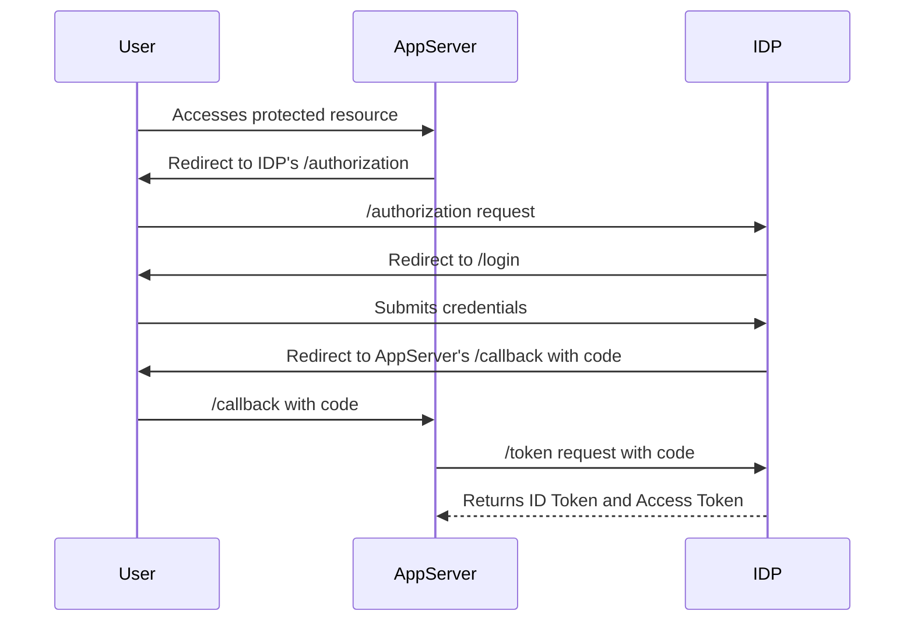
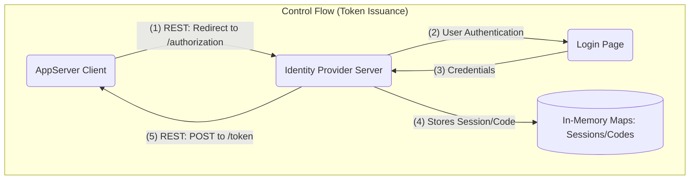
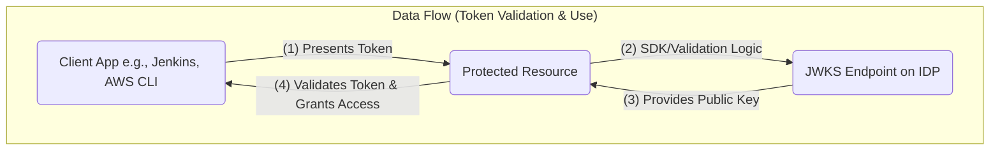

# OpenID Connect (OIDC) Implementation Reference

This document provides a comprehensive overview of the OpenID Connect (OIDC) implementation based on the course materials. It covers the project's architecture, design principles, and the specifics of the OIDC flow as implemented in the `oidc-demo` project.

## 1. Design Philosophy: Requirements, High-Level, and Low-Level Design

The instructor emphasizes a practical, hands-on approach to learning. The OpenID Connect project is broken down into a series of tasks, each building upon the previous one. This iterative process allows for a gradual understanding of the complex OIDC flow.

**Requirements Definition:** The primary requirement is to build a functional OIDC provider and a client application to demonstrate the authentication flow. The project aims to be compatible with real-world applications like Jenkins and AWS IAM.

**High-Level Design:** The high-level design involves two main components:
*   **Identity Provider (IDP):** A server application responsible for authenticating users and issuing tokens.
*   **Application Server (AppServer):** A client application that relies on the IDP for authentication.

The interaction between these components follows the OIDC Authorization Code Flow.

**Low-Level Design:** The project is divided into the following tasks, which represent the low-level design:
1.  **Config Parsing:** Reading and parsing the configuration for the IDP and client applications.
2.  **Authorization Endpoint:** The initial entry point for the OIDC flow.
3.  **Login Endpoint:** Handling user authentication (username/password).
4.  **Discovery Endpoint:** Providing a standard way for clients to discover the IDP's endpoints.
5.  **App Server Authorization:** Initiating the OIDC flow from the client application.
6.  **Token Endpoint:** Exchanging the authorization code for an ID token and an access token.
7.  **AppServer Code Exchange:** The client application exchanges the code for tokens.
8.  **Parsing and Validating the Token:** The client application validates the received tokens.
9.  **JWKS Endpoint:** Publishing the public keys for token validation.
10. **Userinfo Endpoint:** Providing user information to the client application.

This task-based division allows for a clear and manageable implementation process, with each task focusing on a specific part of the OIDC specification.

## 2. Libraries Used in the Project

The instructor's OpenID Connect project primarily relies on the following libraries:

*   **`gopkg.in/yaml.v3`:** Used for parsing the `config.yaml` file.
*   **`github.com/golang-jwt/jwt/v4`:** Used for creating, signing, and validating JSON Web Tokens (JWTs).

The project does not use external OIDC libraries like **Ory Hydra** or **Dex**. Instead, it focuses on implementing the OIDC flow from scratch to provide a deeper understanding of the underlying concepts.

## 2.1. Comparison with Standard OIDC Libraries (`oauth2` and `go-oidc`)

A common question is why this project does not use standard, robust libraries like `golang.org/x/oauth2` and `coreos/go-oidc`.

*   **Educational Purpose**: The primary reason is educational. The instructor's goal is to demonstrate and teach the fundamental mechanics of the OIDC and OAuth2 flows. Using high-level libraries would abstract away the very details the project aims to explain, such as the manual construction of authorization requests, the code-for-token exchange, and JWT validation against a JWKS endpoint.

*   **`golang-jwt` vs. `go-oidc`/`oauth2`**: The `github.com/golang-jwt/jwt/v4` library is **not equivalent** to `go-oidc` and `oauth2`. Their roles are distinct:
    *   **`github.com/golang-jwt/jwt/v4`**: This is a low-level library for a specific task: creating, signing, parsing, and validating the JWT data structure. It knows nothing about OIDC or OAuth2 flows. It simply provides the tools to handle the "ID card" (the token).
    *   **`golang.org/x/oauth2` and `coreos/go-oidc`**: These are high-level client libraries that implement the entire OIDC/OAuth2 flow. They manage redirects, handle the token exchange with the provider, and perform validation. Using them means "outsourcing" the implementation of the authentication flow.

In essence, this project implements the entire authentication system **from scratch**, using `golang-jwt` merely as a tool to handle the token format, not the authentication logic itself.

## 3. Config Parsing

Config parsing is the process of reading the `config.yaml` file and loading the configuration into the application. The `config.yaml` file defines the OIDC provider's URL and the configuration for the client applications.

**`config.yaml`:**
```yaml
url: "http://localhost:8080"
apps:
  app1:
    clientID: "1-2-3-4"
    clientSecret: "secret"
    issuer: "http://localhost:8080"
    redirectURIs: ["http://localhost:8081/callback"]
```

The `ReadConfig` function in `pkg/server/config.go` uses the `gopkg.in/yaml.v3` library to unmarshal the YAML content into the `Config` struct.

**`pkg/server/config.go`:**
```go
package server

import "gopkg.in/yaml.v3"

func ReadConfig(bytes []byte) Config {
	var config Config
	// config parsing
	err := yaml.Unmarshal(bytes, &config)
	if err != nil {
		config.LoadError = err
	}
	return config
}
```

## 4. Authorization Endpoint

The authorization endpoint is the starting point of the OIDC Authorization Code Flow. The client application redirects the user to this endpoint to initiate the authentication process.

**Workflow:**
1.  The client application sends a request to the `/authorization` endpoint with the following query parameters: `client_id`, `redirect_uri`, `scope`, `response_type`, and `state`.
2.  The authorization endpoint validates the request, checking if the `client_id` and `redirect_uri` are valid.
3.  It generates a `sessionID` to track the login request and stores the request details.
4.  It redirects the user to the `/login` page, passing the `sessionID`.

**`pkg/server/authorization.go`:**
```go
// ...
func (s *server) authorization(w http.ResponseWriter, r *http.Request) {
// ...
	w.Header().Add("location", fmt.Sprintf("/login?sessionID=%s", sessionID))
	w.WriteHeader(http.StatusFound)
}
```

## 5. Login Endpoint

The login endpoint handles user authentication.

**Workflow:**
1.  **GET Request:** When the user is redirected to the `/login` page, a GET request is made. The server returns an HTML login form.
2.  **POST Request:** The user submits their credentials, which are sent to the `/login` endpoint via a POST request.
3.  The server validates the credentials using the `users.Auth` function.
4.  If authentication is successful, it generates an authorization code, stores it, and redirects the user back to the client application's `redirect_uri` with the code and state.

**`pkg/server/login.go`:**
```go
// ...
		if auth {
			// ...
			w.Header().Add("location", fmt.Sprintf("%s?code=%s&state=%s", loginRequest.RedirectURI, code, loginRequest.State))
			w.WriteHeader(http.StatusFound)
		}
// ...
```

## 6. Discovery Endpoint

The discovery endpoint (`/.well-known/openid-configuration`) provides a standardized way for client applications to discover the OIDC provider's configuration, including the URLs of the various endpoints.

**`pkg/server/discovery.go`:**
```go
func (s *server) discovery(w http.ResponseWriter, r *http.Request) {
	discovery := oidc.Discovery{
		Issuer:                            s.Config.Url,
		AuthorizationEndpoint:             s.Config.Url + "/authorization",
		TokenEndpoint:                     s.Config.Url + "/token",
		UserinfoEndpoint:                  s.Config.Url + "/userinfo",
		JwksURI:                           s.Config.Url + "/jwks.json",
		// ...
	}
	out, err := json.Marshal(discovery)
	// ...
	w.Write(out)
}
```

## 7. App Server Authorization

The app server authorization is the process where the client application initiates the OIDC flow.

**Workflow:**
1.  The user clicks a "Login" button in the client application.
2.  The client application fetches the OIDC provider's configuration from the discovery endpoint.
3.  It constructs the authorization URL with the required parameters and redirects the user to the OIDC provider's authorization endpoint.

**`cmd/appserver/main.go`:**
```go
// ...
func (a *app) index(w http.ResponseWriter, r *http.Request) {
	// ...
	authorizationURL := fmt.Sprintf("%s?client_id=%s&redirect_uri=%s&scope=openid&response_type=code&state=%s", discovery.AuthorizationEndpoint, os.Getenv("CLIENT_ID"), redirectUri, state)
	w.Write([]byte(`<html>
		<body>
		<a href="` + authorizationURL + `"><button style="width: 100px;">Login</button></a>
		</body>
	</html>`))
}
```

## 8. Token Endpoint

The token endpoint is used to exchange the authorization code for an ID token and an access token.

**Workflow:**
1.  The client application sends a POST request to the `/token` endpoint with the authorization code, `client_id`, `client_secret`, and `redirect_uri`.
2.  The token endpoint validates the request and the code.
3.  It generates and signs an ID token and an access token using the private key.
4.  It returns the tokens to the client application in a JSON response.

**`pkg/server/token.go`:**
```go
// ...
	tokenOutput := oidc.Token{
		AccessToken: signedAccessToken,
		IDToken:     signedIDToken,
		TokenType:   "bearer",
		ExpiresIn:   60,
	}
// ...
```

## 9. AppServer Code Exchange

The app server code exchange is the process where the client application receives the authorization code and exchanges it for tokens.

**Workflow:**
1.  The user is redirected back to the client application's callback URL with the authorization code.
2.  The client application extracts the code from the query parameters.
3.  It makes a POST request to the OIDC provider's token endpoint to exchange the code for tokens.

**`cmd/appserver/main.go`:**
```go
// ...
func (a *app) callback(w http.ResponseWriter, r *http.Request) {
	// ...
	tokens, _, err := getTokenFromCode(discovery.TokenEndpoint, discovery.JwksURI, redirectUri, os.Getenv("CLIENT_ID"), os.Getenv("CLIENT_SECRET"), r.URL.Query().Get("code"))
	// ...
}
```

## 10. Parsing and Validating the Token

After receiving the tokens, the client application must parse and validate them to ensure their authenticity and integrity.

**Workflow:**
1.  The client application fetches the OIDC provider's public keys from the JWKS endpoint.
2.  It uses the public key to verify the signature of the ID token.
3.  It also validates the claims in the token, such as the issuer, audience, and expiration time.

## 11. JWKS Endpoint

The JWKS (JSON Web Key Set) endpoint (`/jwks.json`) publishes the OIDC provider's public keys in a standard JSON format. Client applications use these keys to validate the signatures of the JWTs.

**`pkg/server/jwks.go`:**
```go
// ...
	jwks := oidc.Jwks{
		Keys: []oidc.JwksKey{
			{
				Kid: "0-0-0-1",
				Alg: "RS256",
				Kty: "RSA",
				Use: "sig",
				N:   base64.StdEncoding.EncodeToString(publicKey.N.Bytes()),
				E:   "AQAB",
			},
		},
	}
// ...
```

## 12. Is this a complete self-implemented authentication web server?

Yes, this project is a complete, self-implemented authentication web server that follows the OpenID Connect protocol. The process from understanding the necessary knowledge to implementing the code involves:
1.  **Understanding OIDC Concepts:** Learning about the OIDC flow, JWTs, and the roles of the different endpoints.
2.  **Setting up the Project Structure:** Organizing the code into packages for the server, OIDC utilities, and user management.
3.  **Implementing Each Endpoint:** Writing the code for each endpoint (authorization, token, etc.) one by one.
4.  **Creating a Client Application:** Building a simple web application to test the OIDC flow.
5.  **Testing and Debugging:** Using tests and tools like `curl` and `ngrok` to test and debug the implementation.

## 13. Enable OIDC on Jenkins

The implemented OIDC server can be used to enable OIDC authentication on Jenkins. This involves:
1.  **Installing the OIDC Plugin:** Installing the OpenID Connect Authentication plugin in Jenkins.
2.  **Configuring the Plugin:** Configuring the plugin with the OIDC provider's details, such as the client ID, client secret, and the well-known configuration URL.
3.  **Using `ngrok`:** Using `ngrok` to expose the local OIDC server to the internet so that Jenkins can access it.

## 14. AWS IAM OIDC Federation

The project can be used for AWS IAM OIDC Federation, which allows users authenticated by the OIDC provider to assume IAM roles in AWS. This involves:
1.  **Creating an OIDC Provider in IAM:** Creating an OIDC provider in the AWS IAM console and providing the URL of the OIDC server.
2.  **Creating an IAM Role:** Creating an IAM role that trusts the OIDC provider and defines the permissions for the authenticated users.
3.  **Assuming the Role:** Using the AWS CLI or SDK to assume the IAM role with the ID token obtained from the OIDC provider.

## 15. Storage/Database

This project does not use any external storage or database. It stores the login requests and authorization codes in memory. This means that if the server restarts, all the session information will be lost. For a production environment, a persistent storage solution like Redis would be necessary.

## 16. Session Management

The project manages web app sessions by generating a `sessionID` for each login request and storing it in memory. This `sessionID` is used to track the user's authentication flow. The authorization codes are also stored in memory and are single-use.

## Diagrams

### OIDC Authorization Code Flow



### Architectural Flow Diagrams

Applying a "Control Flow" vs. "Data Flow" architectural model is highly suitable for describing the OIDC project.

#### Control Flow Diagram

The Control Flow represents the core OIDC protocol: the synchronous, stateful interactions required to authenticate a user and issue tokens.



#### Data Flow Diagram

The Data Flow represents the subsequent, often asynchronous, process of using the issued token to gain access to resources. It's the authorization part of the flow.


